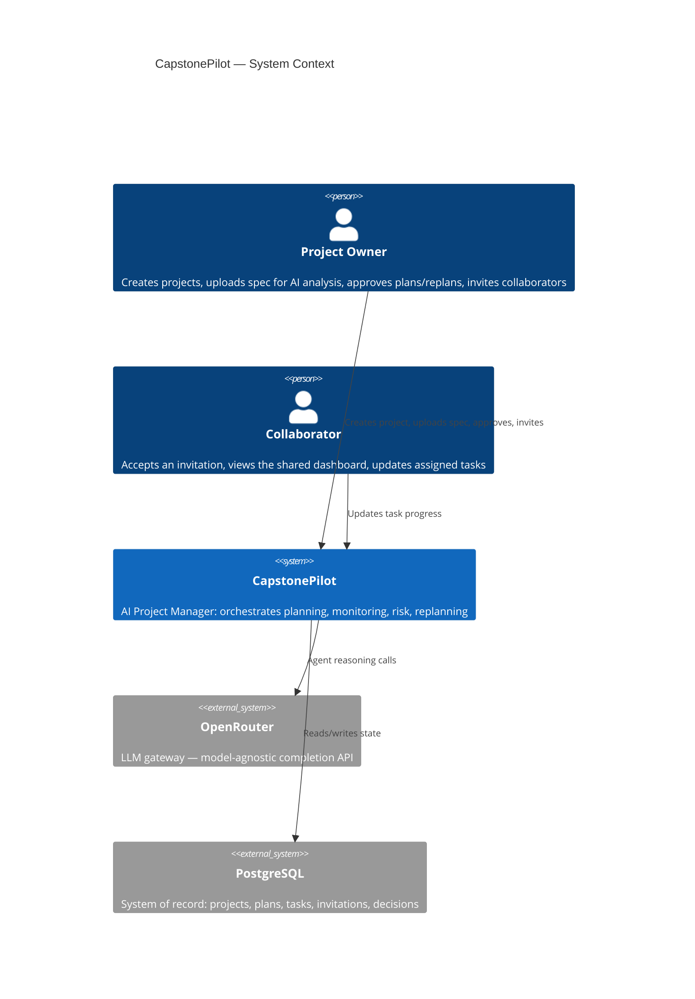
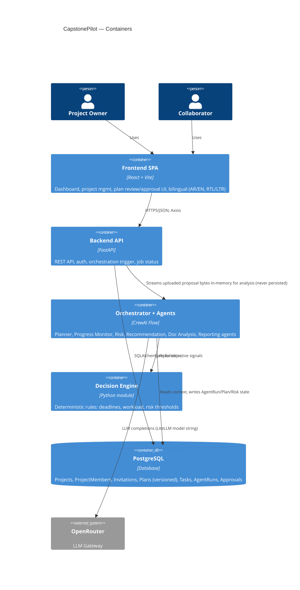
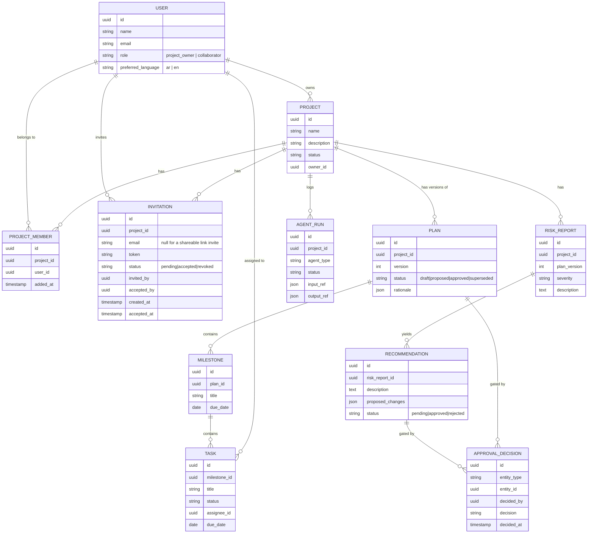

# CapstonePilot — Iteration 1: System Architecture

**Status:** Approved
**Decisions locked in:** Monorepo · LLM via OpenRouter · FastAPI BackgroundTasks + DB polling for async jobs · JWT auth with roles (`project_owner`, `collaborator`)

---

## 1. Why this architecture

CapstonePilot's core claim is that it behaves like a **Living Project Manager**, not a CRUD app with a chatbot bolted on. That claim has three concrete architectural consequences:

1. **The Plan is versioned data, not a UI state.** Every planning/replanning cycle produces a new `Plan` version with a lifecycle (`draft → proposed → approved → superseded`). If the plan were just rows in a `tasks` table with no versioning, "continuously adapts it" and "human-in-the-loop approval" would have nothing to attach to.
2. **Orchestration must be a first-class backend concern, not a prompt.** "One Orchestrator calling specialized agents, combining outputs, requesting approval, executing actions" is a state machine with branching (health-triggered replanning, approval gates). That belongs in code (CrewAI **Flows**), not in a single mega-prompt.
3. **Decisions are hybrid (rules + LLM) by requirement.** So the Decision Engine has to be a real module the Orchestrator calls — not something implicit inside an LLM call.

Everything below exists to serve those three points, kept as simple as it can be while still satisfying them — no Celery, no microservices, no premature multi-tenancy.

---

## 2. System Context



---

## 3. Container View (Monorepo)

```
capstonepilot/
├── frontend/     React + Vite SPA
├── backend/      FastAPI + CrewAI service
└── docs/         Architecture, ADRs
```



**No persistent file storage.** An earlier revision of this architecture included a `Document` entity and a local-disk/object-storage adapter for uploaded project files. That was replaced during frontend-backend wiring: uploaded proposals are analyzed **in memory only** (`ProposalAnalysisService`, text-extracted via PyMuPDF/python-docx) and the file is discarded once the request completes. Only the *results* of analysis — Plans, Milestones, Tasks, RiskReports, Recommendations — are persisted, never the original document. This is deliberate: the system treats an uploaded proposal as a one-time analysis input, not a project asset to archive.

---

## 4. Backend: Clean Architecture layers

```
backend/
├── api/              FastAPI routers + Pydantic request/response schemas.
│                      No business logic. Depends on application/.
├── application/       Use cases / services: ProjectService, PlanningService,
│                      OrchestratorService, DecisionEngine, JobRunner.
│                      Depends only on domain/ (interfaces).
├── domain/            Entities (Project, Plan, Task, Milestone, RiskReport,
│                      Recommendation, AgentRun, ApprovalDecision, User) +
│                      repository interfaces (ports). Zero framework imports.
├── infrastructure/    SQLAlchemy models + repository implementations,
│                      CrewAI agent/crew/flow implementations, OpenRouter
│                      LLM client config, file storage adapter, JWT/security.
└── core/              Config (env), DI wiring, app startup.
```

**Why this shape:** the requirement explicitly asks for SOLID + Clean Architecture + repository pattern. The concrete payoff: `application/` never imports `sqlalchemy` or `crewai` directly — it depends on interfaces defined in `domain/`. That means we can unit-test `PlanningService` with fake repositories, and we can swap CrewAI for something else later without touching API routes.

**Orchestrator placement:** `OrchestratorService` lives in `application/`, but the actual CrewAI `Flow` it drives lives in `infrastructure/agents/`. The service depends on an `OrchestratorPort` interface — so the API layer talks to "the orchestrator," never to CrewAI specifics.

---

## 5. Orchestration Design: CrewAI Flow, not a hand-rolled loop

CrewAI ships a primitive for exactly this shape of problem: **Flows** (`@start`, `@listen`, `@router`, typed state). Rather than reinventing an orchestrator loop, the Orchestrator Agent is implemented as one Flow that:

- Holds **Flow state** = the project's live orchestration context (project id, current plan version, latest health signals).
- Coordinates six **single-purpose Crews**, one per specialized agent: Planner, Progress Monitor, Risk Analysis, Recommendation, Documentation Analysis, Reporting.
- Uses `@router` steps for branching: e.g. after Progress Monitor runs, route to Risk Analysis only if the Decision Engine flags a threshold breach.
- Persists state transitions to the `agent_runs` table so every orchestration cycle is auditable.

```mermaid
flowchart TD
    A[Trigger: new project / task update / schedule tick] --> B[Orchestrator Flow starts]
    B --> C[Documentation Analysis Crew\n(only on new/updated docs)]
    C --> D[Planner Crew\ndrafts Plan v_n]
    D --> E{Project Owner review}
    E -->|Edit/Reject| D
    E -->|Approve| F[Plan v_n: approved\nOrchestrator executes\ntasks/milestones]
    F --> G[Progress Monitoring Crew\n(continuous)]
    G --> H[Decision Engine:\nrule-based health check]
    H -->|Healthy| G
    H -->|Risk threshold breached| I[Risk Analysis Crew]
    I --> J[Recommendation Crew]
    J --> K[Orchestrator assembles\nReplan Proposal = Plan v_n+1 draft]
    K --> L{Project Owner approves replan?}
    L -->|No| G
    L -->|Yes| F
```

**Why Flows over a custom orchestrator class:** we get typed state, conditional routing, and resumability for free, and it keeps the "temporary dynamic agents" future requirement cheap — a new Crew is just a new node the Flow can route to, without changing the Flow's control structure.

**Isolation:** the Flow and its Crews live entirely in `infrastructure/agents/`. `OrchestratorService.run(project_id, trigger)` is the only entry point the rest of the backend calls.

---

## 6. Decision Engine — hybrid rules + LLM

A plain Python module (`application/decision_engine/`), called by the Flow at specific points, not an agent itself:

| Signal | Computed by | Example rule |
|---|---|---|
| Schedule variance | Rule | `(days_elapsed / planned_days) - (tasks_done / tasks_total) > 0.15` → flag |
| Workload imbalance | Rule | stddev of open-task-count across members > threshold |
| Overdue ratio | Rule | `overdue_tasks / total_tasks > 0.2` → flag |
| Interpretation of *why* + proposed fix | LLM (Risk / Recommendation crews) | given the rule-flagged facts + project context, explain risk and propose 2–3 concrete adjustments |

The Flow always computes rule-based facts first and injects them as structured context into the LLM crew's task input — the LLM never has to guess numbers it can be given, and objective thresholds stay deterministic and testable without hitting the LLM at all.

---

## 7. Core Domain Model



`AGENT_RUN` doubles as the **async job record**: every backend-triggered orchestration cycle creates one row, `status` moves `queued → running → succeeded/failed`, and the frontend polls it.

---

## 8. Async Execution (BackgroundTasks + polling)

- `POST /projects/{id}/plan/generate` → creates an `agent_runs` row (`status=queued`) → `BackgroundTasks.add_task(orchestrator_service.run, ...)` → returns `202 { job_id }` immediately.
- Orchestrator Flow updates the same row as it progresses through steps (`running`, then `succeeded`/`failed`, with `output_ref` pointing at the resulting Plan/Report).
- Frontend polls `GET /jobs/{job_id}` every ~2s and renders a "Project Manager is working..." state — this is also the seam for the Iteration-6 dashboard's live activity feed.
- **Explicit trade-off:** single-process concurrency (no distributed workers, no retries-on-crash). Acceptable at capstone scale. The contract (`JobRunnerPort.enqueue(job)`) is the swap point if this ever needs to become Celery/RQ later — nothing above that interface changes.

---

## 9. Auth & RBAC

- FastAPI `OAuth2PasswordBearer` + JWT (access token; refresh token deferred unless requested).
- Passwords hashed with `bcrypt` directly (not via `passlib` — see the frontend-backend-wiring changelog below for why).
- CapstonePilot is built for **student teams only**, not academic supervisors. Two roles, both peers on the team: `project_owner`, `collaborator`. Enforced via a `require_role(...)` FastAPI dependency plus a per-project ownership check (`ProjectService.assert_owner` / `InvitationService._assert_owner`) — a global `project_owner` role lets you create *your own* projects, it does not grant rights over projects you don't own. Displayed in the UI as **"Project Owner"** and **"Collaborator"**.
- **Project Owner:** creates projects, uploads a spec for AI analysis, invites Collaborators (by email or shareable link), manages project settings, approves Plan/Replan proposals, can delete the project.
- **Collaborator:** accepts an invitation, views the shared dashboard, updates assigned tasks. Cannot create projects, cannot upload a project specification, cannot delete a project.
- Every approval (`ApprovalDecision`) is stored, not just applied — this is the audit trail the "human in the loop" requirement implies.

---

## 10. Frontend Architecture (feature-based)

```
frontend/src/
├── app/            Router, layout shell, providers (QueryClient, Auth, i18n)
├── features/
│   ├── auth/
│   ├── projects/
│   ├── documents/
│   ├── planning/       plan review/approval UI, timeline, milestones
│   ├── dashboard/      health, activity feed, charts (Recharts)
│   ├── risks/
│   └── reports/
│   each feature: api/ (axios calls + React Query hooks), components/, pages/
└── shared/
    ├── components/     shadcn/ui-based primitives, no inline styles
    ├── hooks/
    ├── lib/            axios instance, query client
    └── i18n/           en.json, ar.json, language context
```

- **Server state:** React Query (cache, polling for job status, invalidation on mutations) — not hand-rolled `useEffect` fetching.
- **i18n:** `react-i18next` + `i18next-browser-languagedetector`; `<html dir="rtl|ltr">` toggled on language change; preference persisted to `localStorage` and to `User.preferred_language` once authenticated. Tailwind uses logical properties (`ps-`, `pe-` / `rtl:` variants) instead of hardcoded `left`/`right`.
- **Language independence:** UI language (interface) and proposal-document language (content understanding) are independent concerns — `User.preferred_language` drives what language the LLM responds in; the language a submitted proposal happens to be written in only affects extraction/analysis quality in `ProposalAnalysisService`, never UI translation. Since proposals aren't persisted, there is no stored `detected_language` field to carry between requests.

---

## 11. LLM Integration (Google Gemini)

**Superseded — see the "OpenRouter → Gemini" changelog entry below.** CrewAI 1.15's `LLM` class routes `"gemini/<model>"` strings to its native Gemini provider, backed by the official `google-genai` SDK (not LiteLLM, not OpenRouter):

```python
LLM(model="gemini/gemini-flash-latest", api_key=settings.GEMINI_API_KEY, max_output_tokens=..., temperature=...)
```

One Flash-tier model (`settings.GEMINI_MODEL`) serves both Documentation Analysis and the Planner — Flash is already the cheap/fast tier, so the OpenRouter-era two-model split (cheap model for extraction, stronger model for planning) no longer applies. Model choice stays a config change, not a code change.

---

## 12. Key Trade-offs (explicit)

| Decision | Upside | Cost | Mitigation |
|---|---|---|---|
| BackgroundTasks over Celery | Zero extra infra to run/deploy | No retries across process crashes, single-node only | `JobRunnerPort` interface isolates the swap |
| CrewAI Flows over custom orchestrator | Built-in state + branching, less code to maintain | Framework coupling | Confined entirely to `infrastructure/agents/` |
| Repository pattern | Testable, DB-agnostic domain/application layers | More files/indirection than direct ORM calls | Required by the stated SOLID/Clean Architecture goal |
| Plan versioning (not in-place edits) | Replanning, audit trail, "living plan" narrative all fall out of this for free | Slightly more complex queries ("get current approved plan") | One repository method: `get_current(project_id)` |

---

## 13. What Iteration 1 explicitly defers

- Exact Postgres schema/migrations → Iteration 9 (Backend APIs) / Alembic setup.
- CrewAI agent prompts/tools in detail → Iteration 10–11.
- Deployment topology (Docker, hosting) → Iteration 15.
- Dynamic/temporary agent creation mechanism → will hang off the same Flow-routing design in §5, detailed once the fixed agents exist.

---

## Iteration 2: Folder Structure — Approved

The monorepo skeleton (empty directories, no dependencies/code yet) was scaffolded per this architecture:

```
capstonepilot/
├── docs/architecture.md
├── backend/
│   ├── app/
│   │   ├── api/{v1/routers, schemas}
│   │   ├── application/{services, decision_engine, ports}
│   │   ├── domain/entities
│   │   ├── infrastructure/{db/{models,repositories,migrations}, agents/{flows,crews,tools}, jobs, storage, security}
│   │   └── core
│   └── tests/{unit, integration}
└── frontend/
    └── src/
        ├── app/{layout, providers}
        ├── features/{auth,projects,documents,planning,dashboard,risks,reports}/{api,components,pages,hooks}
        └── shared/{components/{ui,common}, hooks, lib, i18n/locales}
```

Project tooling (`package.json`, `pyproject.toml`, Vite/Tailwind config, dependency installs) is deferred to **Iteration 3: Project Setup**.

---

## Frontend-Backend Wiring — Approved

Iteration 9 (Backend APIs) shipped the REST layer; this pass replaced the frontend's hardcoded mock data with real calls against it, ahead of CrewAI integration (Iteration 10). Several design decisions came out of doing this for real rather than against a spec:

**Auth is now real.** A `LoginPage` (`POST /auth/login`), an `AuthProvider` context (JWT in `localStorage`, hydrated via `GET /users/me` on load), and a `ProtectedRoute` guard wrap every `AppShell` route. The Topbar shows the actual logged-in user and role, with a working logout (role labels were renamed to "Project Owner"/"Collaborator" in the pass documented further below). This wasn't optional — nearly every endpoint requires a bearer token, so nothing else could be wired without it first.

**`ProjectMember` was added — a real gap in the original domain model.** The ERD only ever modeled `User.owns → Project`, with no concept of team membership. The frontend's "Team Members" UI (chips on Create Project, the Team card on Project Detail) had nothing to bind to. Added as its own table (`project_members`, unique on `project_id` + `user_id`), a repository, a `ProjectMemberService` (add by email / list / remove), and endpoints under `/projects/{id}/members`. Adding a member now requires them to be an already-registered user (looked up by email) — the old free-text "type any name" input couldn't survive contact with a real backend.

**Documents were removed entirely — this was the biggest pivot.** The original architecture had a persisted `Document` entity + local-disk file storage. Wiring the frontend up against it exposed a real product decision: an uploaded project proposal isn't a project asset to archive, it's a one-time input to AI analysis. So:
- The `Document` entity, table, repository, service, schemas, router, and the `FileStorage` port/adapter were all deleted (migration `d1d755ae53e9` drops the `documents` table and adds `project_members` in the same revision).
- Replaced with `POST /projects/{id}/analyze-proposal`: accepts a PDF/DOCX/TXT file, extracts its text **in memory** (PyMuPDF / python-docx), and returns a result. The file is never written to disk or the database — it goes out of scope when the request completes.
- Text extraction is real. Plan/Milestone/Task/RiskReport/Recommendation generation *from* that text is not — that's CrewAI's job (Iteration 10+), and the response is honestly scoped to what actually happens today (extraction), not what will happen once the orchestrator exists.
- Consequence: Create Project became a two-stage flow. `ProjectMember` and the proposal upload both need a real `project_id` to attach to, the same constraint that forced the document-upload timing question in the first place. Stage 1 (name/description/dates) creates the project; stage 2 (team members + optional proposal analysis), shown on the same page once the project exists, was previously going to be document upload alone but generalized to cover both once the members gap surfaced.

**Progress became project-scoped.** `/progress` (global, implicitly showing "the one project") moved to `/projects/{id}/progress`, reached via a "View Plan" action on Project Detail. Milestone completion % and status badges are computed client-side from real per-milestone task lists (`useQueries` fetches every milestone's tasks in parallel; the same query keys are reused inside each `MilestoneAccordion`, so React Query dedupes rather than double-fetching). Clicking a task's status icon cycles `pending → in_progress → done` against `PATCH /tasks/{id}` — the one piece of real interactivity beyond read-only display, matching the "Update Progress" operational action the human-in-the-loop section already allowed for.

**Dashboard, Risks, and Recommendations stay on mock data, visibly.** All three depend on data that doesn't exist yet — `RiskReport`/`Recommendation` have no endpoints until Iterations 12-13, and Dashboard has no "which project" concept to aggregate around even where real data exists (Task/Milestone). Rather than half-wire them into something misleading, each carries a `PreviewDataBanner` stating plainly that it's preview data and when it connects.

---

## Project Owner / Collaborator Simplification — Approved

CapstonePilot is for student capstone teams, not academic supervisors. This pass simplified the role model and the creation flow to match that directly, rather than the more general RBAC shape the earlier iterations had assumed.

**Role rename, all the way through, not just labels.** `member` → `collaborator` (the enum value itself, not just the UI string) across the domain, database, seed data, and tests. `project_owner` keeps its name but is now displayed as **"Project Owner"** (not "Project Lead" — that was the previous pass's guess before this session specified exact terminology). `collaborator` displays as **"Collaborator"**. There is no third role and no supervisor concept anywhere in the system.

**A real authorization gap got fixed while touching this code.** `require_role(PROJECT_OWNER)` only ever checked a caller's *global* role — it never checked whether they owned the *specific* project being mutated. Any project-owner-role user could previously PATCH or DELETE any other owner's project. Since "Collaborator cannot delete the project" only means something if "Project Owner can" is actually scoped to *their* project, this was fixed now: `ProjectService.assert_owner` and `InvitationService._assert_owner` both check `project.owner_id == requesting_user.id`, not just the role claim. Covered by `test_only_the_owning_project_owner_can_update_or_delete`.

**Direct "add member by email" was replaced with real invitations — Collaborators now consent.** The previous pass let a Project Owner add *any* registered user to a project just by typing their email, no acceptance step. That's gone. A new `Invitation` entity (table `invitations`: `project_id`, `email` nullable, unique `token`, `status` pending/accepted/revoked, `invited_by`, `accepted_by`/`accepted_at`) backs two flows:
- **Email invite:** `POST /projects/{id}/invitations` with one or more addresses. Single-use per email — accepting requires the authenticated user's email to match the invitation, and flips it to `accepted`. If the address isn't registered yet, the invitation just sits `pending`; `GET /invitations/mine` (matched by the current user's email) is how it becomes visible once they do register and log in — no email-sending infrastructure exists, so this is the whole delivery mechanism today. The domain layer doesn't assume SMTP either way, so plugging in real delivery later is additive, not a rewrite.
- **Link invite:** `POST /projects/{id}/invitations/link` gets-or-creates one reusable invitation per project (`email = NULL`). Anyone who calls `POST /invitations/{token}/accept` while authenticated joins — multiple people can use the same link, and accepting does *not* flip its status, so it stays valid until the owner explicitly revokes it (`DELETE /invitations/{id}`). No expiry timer, matching "expire only if the owner revokes it."

Both flows funnel into the same `ProjectMemberService.add_member(project_id, user_id)` for the actual membership row — `Invitation` is a consent/pending layer in front of `ProjectMember`, not a replacement for it.

**Create Project is now the literal 4-step flow requested:** Name → Description → Upload Project Specification (optional, PDF/DOCX) → **Generate AI Project Plan**. Creation and proposal analysis happen together behind that one button (create the project, then analyze the file if one was provided) rather than as two separate stages — the previous pass's "create, then optionally upload after" became "fill everything in, then one combined action" once Team Members moved out of this page entirely. Start Date/Deadline stayed as optional fields (kept, not dropped, per this session's direction) but are visually secondary to the 4 numbered steps.

**"Invite Collaborators" now lives in Project Settings, not on the creation page.** A new `/projects/{id}/settings` route (Project Owner-only, both via a frontend check on `project.owner_id` and the backend's real ownership check) holds project name/description editing, the email-invite form, the "copy invite link" action, a list of sent invitations with revoke, and project deletion behind a confirm step. Create Project's post-creation success state links here ("Invite Team Members") instead of duplicating the invite UI on two pages.

**A Register page and public routing exist now, for one reason: the link-invite flow requires it.** "Anyone opening the link should log in if they have an account, otherwise register first, then automatically join" isn't satisfiable without a real registration page, so one was built (`/register`, public, auto-login on success like `/login`). `/invite/:token` sits behind `ProtectedRoute` — an unauthenticated visitor is redirected to `/login` with the invite path preserved as the post-auth destination, exactly like any other protected route; the accept call fires once auth resolves.

Verified: 24 backend tests (up from 20 — added ownership-boundary, email-invite-pending, duplicate-member, wrong-email-acceptance, revoked-invitation, and link-reusability cases; removed the direct-add-member tests since that capability no longer exists), ruff clean, frontend build and oxlint clean. Same limitation as every prior pass: no browser tool here, so the actual in-browser flows (register → auto-join via link, email invite → accept from the pending-invitations view, settings-page delete confirmation) have not been visually verified.

---

## Figma-Style Sharing, Notifications, and Data-Integrity Fixes — Approved

This pass replaced the Settings-page invite panel with a real Share dialog (Figma/Canva-style), added the pieces that panel implied but didn't have yet (email delivery, expiry, resend), and fixed two correctness gaps in existing code that surfaced while making project deletion actually safe. Two requests in this pass directly reversed constraints from the previous one; both are called out explicitly below rather than silently overridden.

**Two prior constraints were deliberately reversed, on this session's explicit instruction:**
- *"Do not implement email delivery now"* → reversed. An `EmailService` port now exists (`send_invitation_email`), with an `SmtpEmailService` (stdlib `smtplib`, configured via `SMTP_HOST`/`PORT`/`USERNAME`/`PASSWORD`/`FROM_EMAIL` in `.env`) and a `ConsoleEmailService` fallback used automatically whenever `SMTP_HOST` is unset. No real SMTP credentials exist in this environment, so today every invite prints the email to the backend console (`[email:console] ...`) rather than actually delivering — the moment real credentials are added to `.env`, delivery starts working with no code change, which was the point of designing it as a port in the first place.
- *"The invitation should expire only if the owner revokes it"* → reversed for **email invitations only** (7-day expiry, `Invitation.expires_at`, enforced in `accept_invitation` as `InvitationExpiredError` → `410 Gone`, same status code as revocation). **Link invitations keep the original behavior** — `expires_at` stays `NULL` for them, so a shareable link still only stops working when the owner explicitly revokes it. This split reflects that the two invitation types are semantically different (a link is reusable and open-ended by design; an email invite is a single targeted offer with a shelf life), and was the most direct way to satisfy both instructions rather than picking one to ignore.

**The Share dialog replaces the old page.** `ProjectDetailPage` gained a `Share` button (top-right) opening `ShareModal`: an invite-by-email form + shareable-link card (owner-only), a unified "People with access" list (the owner, synthesized from the project's now-included `owner_name`/`owner_email` fields, plus accepted collaborators, plus pending email invitees shown inline with a Pending badge), and a separate "Pending Invitations" section with per-invitation **Resend**, **Copy Link**, and **Cancel** actions. `ProjectSettingsPage` no longer duplicates any of this — it's back to just project details + delete. The old `TeamMembersSection`/`TeamMemberChip`/`PendingInvitationsList` components were deleted outright rather than left unused.

**Resend is a new capability, not just a UI label.** `POST /invitations/{id}/resend` (owner-only, email invitations only, must still be pending) refreshes `expires_at` by another 7 days, keeps the same token so any copy of the old link still works, and re-sends through `EmailService`.

**A public, unauthenticated preview endpoint now exists so the invite-accept flow doesn't have to guess.** `GET /invitations/{token}/preview` returns the project name, the invitation's email (if any), and whether that email already has an account — enough for `InviteAcceptPage` to route a signed-out visitor straight to `/register` (prefilled, email locked) when they're clearly new, or to `/login` otherwise, instead of always bouncing through Login first. `/invite/:token` moved out of `ProtectedRoute` to a public top-level route to make this possible — an authenticated visitor still goes straight through the accept flow exactly as before.

**Two correctness gaps got fixed, surfaced by making project deletion and member removal actually safe:**
- `ProjectMemberService.remove_member` never checked that the caller owned *that* project — same class of bug fixed for `ProjectService`/`InvitationService` in the previous pass, missed here. Now takes `requesting_user_id`, asserts ownership, and also rejects removing the owner themselves (`CannotRemoveOwnerError`) — the UI never renders a remove option on the owner's own row, but the backend enforces it independently since transferring ownership isn't built yet.
- `ProjectService.delete_project` only ever deleted the `projects` row itself. SQLite's foreign keys aren't enforced in this app (`PRAGMA foreign_keys` is off), so this silently left orphaned `project_members`, `invitations`, `plans`, `milestones`, and `tasks` rows behind rather than erroring. Rather than turning on FK enforcement and cascading at the schema level (a riskier, batch-mode migration touching most of the tables), the cascade is now explicit in the service: tasks → milestones → plans → members → invitations → project, in that order, using each repository's existing `list_by_*`/`delete` methods plus two new bulk `delete_by_project` methods. `agent_runs`/`risk_reports`/`recommendations`/`approval_decisions` are intentionally not part of this cascade — nothing in the app writes to those tables yet (they're CrewAI-era stubs), so there's nothing to orphan until those features exist, at which point their cascade needs adding too.

**A toast notification system exists for the first time.** `sonner` (a small, dependency-free toast library — chosen over hand-rolling one, since this is exactly the kind of small, well-solved UI problem not worth re-deriving) is mounted once in `App.jsx`. Every mutation hook that previously invalidated a query cache silently now also toasts success/failure: project create/update/delete, invite sent/resent/cancelled, collaborator removed. Toasting "collaborator joined" from the *inviting owner's* perspective was scoped out — there's no push channel (websockets) to tell an owner's open tab that someone else just accepted elsewhere; the collaborator list still updates without a refresh because it shares a query key with the modal that shows it, but that's cache-driven consistency, not a live notification.

**Project cards got their own three-dot menu** (Open / Edit / Delete, owner-only), reusing the new shared `DropdownMenu`, `Modal`, and `ConfirmDialog` primitives (`shared/components/ui/`) that the Share dialog and Project Detail's own new Actions menu (Edit / Archive-placeholder / Delete) also build on — one confirm-dialog implementation now backs every delete flow in the app instead of each page hand-rolling its own. `ProjectDetailPage` also gained the breadcrumb (`Projects / {name}`) and `← Back to Projects` link it never had.

Verified: 31 backend tests (up from 24 — added owner-info-on-read, resend (happy path, link-invitation rejection, ownership), preview (known/unknown email, 404), expiry-enforced-on-accept, owner-removal-blocked, non-owner-removal-forbidden, and cascade-delete-leaves-no-orphans cases), ruff clean, and a full manual `curl` walkthrough against a locally running `uvicorn` covering invite → preview → resend → accept → owner-removal-rejected → delete-cascade end to end (including confirming the console-fallback email actually prints). Frontend: `npm run build` and `oxlint` both clean.

**Addendum — real browser verification, not just code review.** The "no browser tool" limitation noted above (and in every prior pass) was closed out in the same session: `@playwright/test` was added (`frontend/tests/e2e/app.spec.js`, `npm run test:e2e`), and a 14-case suite was run against the actual `vite`+`uvicorn` dev servers in Chromium — register → create project → breadcrumb/back nav → Share dialog email invite → copy shareable link (real clipboard read) → resend → a second browser context accepting the link (register → auto-join) → owner sees the collaborator as Accepted → re-inviting that now-existing member surfaces the real error toast → cancel a pending invite → remove a collaborator → Archive placeholder toast → delete from the detail page's Actions menu (redirect + toast) → delete from a card's menu in the list. All 14 pass, twice in a row with fresh data each run. Two real bugs surfaced and were fixed by this process, not hypothesized in review: `Modal` had no `role="dialog"`/accessible name, making its content unaddressable by assistive tech and by tests alike (now fixed, which is an accessibility fix as much as a testability one); and the two `hasText` row-scoping locators in the first draft of the test were fragile DOM-traversal guesses that resolved to the wrong element - fixed by adding `data-testid="access-row"`/`data-testid="pending-invitation-row"` to `ShareModal`'s row containers rather than continuing to guess ancestor depth.

---

## Share Dialog Polish, Link Lifecycle, and a Real StrictMode/React-Query Bug — Approved

A follow-up pass on the Share dialog, matching a more literal Figma/Canva/Notion reference layout, plus one debugging session that turned up a genuine, non-obvious production bug worth documenting in full since it wasn't hypothetical - it was caught, reproduced, and fixed via the Playwright suite added in the previous pass.

**Share dialog reordered to lead with the link, not the email form.** The shareable link is now the first thing in the dialog (with "Anyone with this link can join this project." framing text), followed by an explicitly labeled "Optional — Invite by Email" section with copy clarifying the link is the primary sharing method. A visible **Close** button was added at the bottom of the dialog (in addition to the existing header `×` / backdrop-click / Escape) since the reference layout calls it out as part of the structure, not just an implicit affordance.

**Link lifecycle is now fully manageable, not just copyable.** `InviteLinkCard` was rebuilt to derive its state from the project's real invitation list (via a new `linkEverExisted` flag - has a link invitation ever existed for this project, active or revoked) instead of only reacting to its own mutation's result, and gained two new actions:
- **Regenerate Link** - `POST /projects/{id}/invitations/link/regenerate` (new endpoint, `InvitationService.regenerate_link_invitation`) atomically revokes whatever link is currently active and mints a fresh token, so old copies of the link stop working immediately. Implemented server-side rather than as two separate frontend calls specifically to avoid a window where neither link is valid or both are.
- **Disable Link** - reuses the existing revoke endpoint (a link invitation is revoked exactly like an email one) but is exposed as its own hook (`useDisableLinkInvitation`) purely so the toast reads "Invite link disabled" instead of "Invitation cancelled." Once disabled, the card shows "Link sharing is currently disabled for this project." and a **Create New Link** button rather than silently regenerating one - silently recreating it would defeat the point of the owner explicitly turning it off.

**"Transfer ownership before leaving" is now a real (if honest) UI affordance.** The owner's own row in "People with access" gained a three-dot menu - previously the owner had no menu at all, since they can't remove themselves. Its one item shows a toast explaining that ownership transfer isn't built yet, following the same honest-placeholder pattern as "Archive Project" from the previous pass, rather than a dead-looking disabled control.

**A production correctness gap: three GET endpoints didn't support request cancellation.** `getProjects`, `getProjectById`, `getProjectMembers`, and `getProjectInvitations` didn't accept or forward React Query's `AbortSignal` to axios. Confirmed via Playwright + direct DB inspection that this let an earlier, slower in-flight refetch resolve *after* a later one and silently overwrite the query cache with stale data - reproducible by regenerating and then immediately disabling the invite link, two rapid-fire actions that each invalidate the same query. All four now thread `signal` through (`apiClient.get(url, { signal })`), letting React Query actually cancel superseded requests instead of racing them.

**A second, deeper bug in the same investigation: mutations fired from a mount effect can get stuck.** The dialog auto-creates a shareable link the moment it opens rather than waiting for a first click. That auto-create was originally a `useMutation().mutate()` call inside a `useEffect`. Under React 19 StrictMode's dev-mode double-invocation of effects, this left `mutation.isPending` (and even a per-call `onSettled` callback passed directly to `.mutate()`) stuck reporting "still pending" *forever* - even though the underlying HTTP request had already succeeded and the query cache had the correct data. The UI would get permanently stuck showing "Preparing your invite link..." with all actions disabled, but only in scenarios where the link section re-entered its empty state later (e.g., right after Disable) - masked the rest of the time because `linkInvitation` being truthy short-circuited the check. This was tracked down empirically, not by inspection: instrumented with targeted console logging correlated against real network request/response timestamps via Playwright's `page.on('request'/'response')`, across roughly a dozen full-suite reruns, before the actual mechanism (StrictMode detaching the mutation's observer between the phantom unmount and remount) was confirmed. The fix: the auto-create path no longer goes through `useMutation` at all - it calls the plain API function directly inside the effect, manages its own `useState` "preparing" flag via a plain `.finally()`, and calls `queryClient.invalidateQueries` itself on success. A plain promise has no observer to detach, so it can't get stuck. The user-triggered "Create New Link" button still uses the mutation hook normally, since a click handler doesn't have this mount-timing problem.

Verified: 32 backend tests (added `test_regenerate_link_invitation_revokes_old_token_and_requires_ownership`), ruff clean, `npm run build` and `oxlint` clean, and the full 17-case Playwright suite (3 new cases: regenerate, disable-then-recreate, transfer-ownership placeholder) passing 6 consecutive full runs with zero flakes after the StrictMode fix - it had failed on 1 of every ~4 runs before it, which is exactly the kind of intermittent failure that's easy to dismiss as "flaky test" rather than a real bug; it wasn't.

---

## OpenRouter → Google Gemini — Approved

Iteration 10 shipped against OpenRouter (any model, one key, easy to demo). This pass replaces it with the official Google GenAI SDK end to end, driven by two things: removing a paid routing middleman, and making the Planner's token spend deliberately minimal rather than left at library defaults.

**CrewAI 1.15 (already installed) turned out to have a native Gemini provider** - `crewai.llms.providers.gemini.completion.GeminiCompletion`, backed by `google-genai` (`from google import genai`), not LiteLLM. `LLM(model="gemini/gemini-2.5-flash", ...)` routes there automatically; discovered by reading crewai's own source rather than assuming LiteLLM was still in the dependency chain (it isn't - this crewai version dropped it in favor of native per-provider clients). `google-genai`, `google-auth`, and `pyasn1-modules` added to `requirements.txt`; nothing OpenRouter-specific was ever a package dependency, so removal was purely config/code.

**Config collapsed from two model settings to one.** `OPENROUTER_API_KEY`/`DOC_ANALYSIS_MODEL`/`PLANNER_MODEL` (a cheap-tier/strong-tier split, since OpenRouter fronts many providers at different price points) became `GEMINI_API_KEY`/`GEMINI_MODEL` (default `gemini-flash-latest` - `gemini-2.5-flash` itself 404s as "no longer available to new users" on a freshly-created API key, confirmed against the real API; `gemini-flash-latest` is Google's own always-current-Flash alias) - Flash is already the cheap/fast tier, so both Documentation Analysis and the Planner share one model now.

**Token spend is now an explicit budget, not a library default.** `LLM(..., max_output_tokens=256, temperature=0.1)` for Documentation Analysis; `max_output_tokens=900, temperature=0.2` for the Planner. 512 was the original spec for the Planner, but is genuinely too small for the requested shape (4-6 milestones x 3-5 tasks, 4 fields each) - confirmed empirically, not assumed: even with thinking disabled and a minified-JSON prompt, 512 truncated mid-response every time. 900 is the smallest cap that reliably completes the *minimum* requested shape (4 milestones x 3 tasks); still a 98.6% reduction from crewai's 64000-token default, which was the actual point of capping this at all. Documentation Analysis became structured output (`DocumentAnalysisSchema`: goal/deliverables/constraints) instead of free-text prose, both for token economy and so the Planner consumes typed fields instead of re-parsing a paragraph. The Planner's schema gained `dependencies` (one list) and `estimated_timeline` (one sentence) per this pass's spec, alongside the milestone/task bounds moving from 3-4/2-3 to 4-6/3-5 (prompted to prefer the low end, to actually fit the budget).

**Two real, non-obvious bugs surfaced only by testing against the real API with a real key - neither was hypothetical:**
- **Gemini's "thinking" mode was silently consuming the entire output budget before any visible answer.** `LLM.token_usage` showed `completion_tokens=252` against a 256-token cap, with `reasoning_tokens=245` of that - eleven visible characters (`{"goal": "Build a mobile`, cut off) and the rest spent on invisible chain-of-thought. crewai auto-enables `thinking_config` for any model whose name regex-matches `gemini-(\d+...) >= 2.5`, but the failure happened even beyond that (the alias in use, `gemini-flash-latest`, doesn't match that regex string-wise, yet the underlying model Google resolves it to clearly still thinks by default). Fixed by explicitly passing `thinking_config=types.ThinkingConfig(thinking_budget=0)` on both `LLM` instances in `llm.py` - which is also, literally, "do not ask the model to explain its reasoning," one of this pass's own requirements, not just a bug fix.
- **`output_pydantic` on crewai's native Gemini provider triggers a real hang.** Structured output there isn't implemented via Gemini's native `response_schema` - it's a synthetic `"structured_output"` function-declaration tool, which makes `google-genai` treat the call as tool-use and enter its own Automatic Function Calling loop (`AFC is enabled with max remote calls: 10`, logged by the SDK itself). Observed hanging for 5+ minutes with no error and no completion on a real call before being killed - a production instance of exactly the "unnecessary retries/duplicate calls" this pass was asked to eliminate, just not in a place code review would have caught it. Fixed by dropping `output_pydantic` entirely from both crews' `Task`s: the prompt now asks for JSON directly, `Crew.kickoff().raw` is parsed and validated into the same Pydantic schemas by hand (`planning_flow.py`'s `_parse_json_response`, strips an optional markdown fence then `json.loads` + `model_validate`). This is also *why* `Task.guardrail_max_retries` no longer appears anywhere - it only applies to `output_pydantic`'s guardrail, which no longer exists; the retry-elimination goal is satisfied more directly by the manual-parse path never having a retry story in the first place.

**A disk-backed plan cache** (`infrastructure/agents/plan_cache.py`, `backend/.cache/plan_cache.json`, gitignored) sits in front of `CrewAIPlanningOrchestrator.generate_plan()`, keyed on a SHA-256 hash of `(project_name, project_description, proposal_text)`. An identical repeat request - same project, same re-uploaded proposal - returns the cached plan with zero LLM calls, and survives backend restarts since it's on disk rather than in-process memory.

**Test isolation held.** The existing `conftest.py` pattern (default every test to `FakePlanningOrchestrator`, one dedicated test explicitly opts out via `monkeypatch` to exercise the real key-selection branch) needed no structural change - only renaming `OPENROUTER_API_KEY` references to `GEMINI_API_KEY` throughout. That existing discipline is what kept this migration from quietly turning the whole test suite into a paid-API smoke test.

Verified: 42 backend tests green post-migration, ruff clean, and - critically - actually exercised against a real `GEMINI_API_KEY`, not just the fake fallback: the full `plan/generate` → poll → succeed flow produced a real 4-milestone, 12-task plan via HTTP end to end (confirmed by direct DB inspection, not just a 200 status), and the two bugs above were only found *because* this pass insisted on a live run instead of trusting the fake orchestrator's green tests. The disk cache was verified directly at the unit level (miss → write → hit with all fields intact → correctly misses on different input → survives a simulated process restart) rather than via a second live generation, since the account's free-tier daily quota (20 requests/model/day) was exhausted by this session's own verification calls partway through - itself a real, unprompted demonstration of why the token/call minimization in this pass matters.

---

## One Gemini Call Per Generation, 300-Token Budget — Approved

The previous pass's two-step Flow (Documentation Analysis, then Planner - two Gemini calls, 256 + 900 max_output_tokens) worked, but was still spending more of the Free Tier's very limited daily quota than necessary now that both steps hit the same account. This pass collapses it to one call and one hard 300-token budget, and closes a real gap: a quota failure looked identical to "no proposal was uploaded" from the user's point of view.

**Documentation Analysis is gone as a separate step, not just cheaper.** `documentation_analysis_crew.py` is deleted outright. `planner_crew.py`'s single `Task` now receives the raw extracted proposal text directly and is asked to extract-and-plan in one pass - there was never a hard requirement that these be two LLM calls, that was just how the CrewAI Flow happened to be shaped in the prior pass. `PlanningFlow` is now a single `@start` step (still a real `Flow`, not a plain function call, so the same "future steps hang off this one" extension point from architecture.md section 5 still holds for Risk/Recommendation later).

**Hitting 300 tokens reliably needed shrinking the wire format, not just the prompt.** JSON field *names* get repeated once per item (once per task, once per milestone), so they're the highest-leverage place to cut: the model is now asked for `{"s":...,"m":[{"t":...,"d":...,"k":[{"t":...,"p":...,"d":...}]}],"dep":[...],"tl":...}` instead of full field names in the wire format. `TaskPlanSchema`/`MilestonePlanSchema`/`PlannerOutputSchema` use pydantic `Field(alias=...)` with `populate_by_name=True`, so the *Python* attribute names everywhere else in the codebase (`title`, `days_from_start`, `tasks`, ...) are unchanged - only what the model has to type out got shorter. Milestone/task counts also came down from 4-6/3-5 to 3-4/2-3 (still "generate only" a real plan, just sized to actually fit). Confirmed empirically against the real API: 227 completion tokens for a full 4-milestone/8-task plan, comfortably under 300, `reasoning_tokens=0`.

**`Agent.max_retry_limit` (crewai default: 2) is now explicitly 0.** This is on top of the previous pass's `output_pydantic` removal (which already killed the AFC-loop risk and the `guardrail_max_retries` retries) - between the two, there is no remaining path by which one `generate_plan()` call can turn into more than one real HTTP request to Gemini.

**A quota failure used to look exactly like "you didn't upload a file."** `run_planning_job`'s except block now runs `_describe_error()`, which checks the exception text for `RESOURCE_EXHAUSTED`/`429`/`quota` and rewrites it to a `QUOTA_EXCEEDED:`-prefixed message before storing it on `AgentRun.error` (kept as a string-prefix convention rather than a new DB column/migration for one flag). `CreateProjectPage.jsx` checks that prefix specifically and shows an amber "quota exceeded, try again later" message instead of the generic "plan starts empty" copy used for every other failure. The Plan itself still isn't touched on failure either way (stays at its original empty `draft`, exactly as before) - what changed is that the *user* is now told why, instead of a quota exhaustion looking identical to a no-op.

**The plan cache design didn't need to change**, and is why "if the same document is uploaded again, reuse the cached plan" was already satisfied going into this pass: it's keyed on a hash of `(project_name, project_description, proposal_text)` at the `CrewAIPlanningOrchestrator.generate_plan()` boundary, one layer above wherever the internal call structure happens to be one step or two - re-uploading the identical proposal to the same project (e.g. after a reject, or a retry after a transient failure) returns the cached plan with zero Gemini calls, deliberately scoped to *(project, document)* rather than document content alone so a plan's summary never references the wrong project name.

Verified against the real API, on a fresh key: a direct single-call test produced a complete, valid 4-milestone/8-task plan in 227 completion tokens on the first attempt (no retries needed). The full HTTP flow was then confirmed twice more - both times correctly landing on `QUOTA_EXCEEDED:` once that key's own daily quota was exhausted by this session's testing, which also gave a real (not simulated) end-to-end confirmation of the new error-classification path: `AgentRun.error` correctly prefixed, `CreateProjectPage` correctly showing the amber quota message instead of the generic one. 42 backend tests green, ruff clean throughout.

---

## Iteration 12: Automatic Risk Monitoring, Recommendations & a Real Dashboard — Approved

Dashboard, Risks, and Recommendations were the last three pages still on hardcoded mock data behind a "preview data" banner. `RiskReport`/`Recommendation` have had DB tables since the first migration but zero application-layer code behind them - nothing had ever written to those tables. This pass builds the whole vertical slice and, per this document's own original section 5-6 design (continuous monitoring -> Decision Engine -> Risk Analysis -> Recommendation), makes it run automatically on a schedule rather than a button click, with the Dashboard becoming the primary place a project owner sees it.

**The Decision Engine (section 6) is now real code, not just a diagram.** `application/decision_engine/rules.py`'s `compute_signals(project, tasks)` is pure, local, and free - no DB writes, no network - and runs for *every* non-completed project on *every* scheduler tick. It computes three numbers (`schedule_variance`: elapsed-time-fraction minus done-task-fraction; `overdue_ratio`: incomplete tasks past their due date; `workload_imbalance`: population stddev of open-task counts per assignee) against fixed thresholds (0.15 / 0.2 / 2.0), and only a project that actually crosses one of them - `breached=True` - ever becomes eligible for a paid Gemini call. This is the same "rules compute facts, the LLM interprets them" split the original design called for, and it means the free tier's daily quota is spent on genuinely at-risk projects, not spent (or wasted) on a fixed schedule regardless of project health.

**Automatic, not on-demand - a plain asyncio loop, no new deployed infra.** `infrastructure/scheduler.py`'s `run_monitoring_loop` is started from `main.py`'s new `lifespan` context manager via `asyncio.create_task`, ticking every `MONITORING_INTERVAL_SECONDS` (default 1800s / 30 min). This is the same trade-off BackgroundTasks already made over Celery/APScheduler (section 12) applied one level up: no message broker, no worker process, just a task living inside the same event loop as the API. There is deliberately no manual "analyze now" endpoint - the core logic, `run_monitoring_tick(session_factory, risk_orchestrator)`, is a standalone function specifically so it *can* be called directly (by tests, or by hand for verification) without needing to wait out a real 30-minute interval or add an endpoint that wasn't asked for. `settings.ENABLE_SCHEDULER` (default `True`) gates it; `tests/conftest.py` sets it `False` before each `TestClient(app)` so the real loop never races a test's own temp DB.

**One combined Gemini call per breached project, same discipline as the Planner.** `risk_crew.py` has one `Agent`/`Task` that receives the Decision Engine's already-computed numbers as a short text summary (never asked to recompute them) and returns risks and recommendations together in one minified-JSON response - same short-key wire schema (`Field(alias=...)`), same `max_retry_limit=0`, same deliberate absence of `output_pydantic` (the native-Gemini-provider AFC-hang risk documented above applies identically here), same 300-token budget and `thinking_budget=0` as the Planner's `LLM`. `risk_flow.py` is a one-`@start()`-step `Flow`, structurally identical to `planning_flow.py`.

**A real, non-obvious bug found only by testing against the live API with a large existing dataset: the disk cache stopped duplicate Gemini calls but not duplicate database rows.** The cache (`infrastructure/agents/risk_cache.py`, same disk-backed-JSON design as `plan_cache.py`, keyed on a rounded hash of a project's signal values) was originally checked *inside* `CrewAIRiskOrchestrator.analyze()` - so a second tick against an unchanged breach correctly skipped the LLM call, but `run_monitoring_tick` had no way to know that had happened, and unconditionally persisted a fresh `AgentRun` + `RiskReport` + `Recommendation` set anyway. Caught during manual live verification against the real dev database: after two ticks on one deliberately-overdue test project, `risk_reports` held 4 rows (two real distinct findings, each written twice) from a single real Gemini call. The fix moves the cache check to `scheduler.py`, *before* it decides to call `analyze()` at all - a cache hit now means "this exact signal state was already recorded, do nothing," not just "don't ask Gemini again." `CrewAIRiskOrchestrator` no longer touches the cache itself; caching is a scheduling/persistence decision, not an orchestrator-implementation detail, since the scheduler is this port's only caller. Re-verified against the same live database afterward: a third tick against the same unchanged project created zero new rows and made zero new calls.

**Recommendation approval is a direct status flip**, mirroring `PlanService.approve_plan`/`reject_plan` exactly (`RecommendationService.approve_recommendation`/`reject_recommendation`, owner-only, `pending -> approved`/`rejected`) - no new `ApprovalDecision` audit entity, which stays as unused as it already was for Plans.

**The Dashboard is now the primary monitoring page**, aggregating across every project the user owns/belongs to by default. `ProjectFilterDropdown` + `useDashboardData(selectedProjectId)` switch between "All Projects" and one project entirely client-side (`useQueries` fan-out across projects -> milestones -> tasks/risks/recommendations, no route change) - selecting a project re-renders the same page in place, per the explicit requirement that this become the main monitoring experience rather than a secondary aggregate view. Risks and Recommendations themselves became project-scoped routes (`/projects/:id/risks`, `/projects/:id/recommendations`, linked from `ProjectDetailPage`) rather than global pages, since a risk only ever belongs to one project - the Dashboard is where the aggregate view lives now. `RecommendationsPreview`/`MilestonesPreview` on the Dashboard are wired to this same real, aggregated data; `ActivityFeed` stays mock with its own card-scoped `PreviewDataBanner`, stated plainly rather than faked, since there is no activity-log backend anywhere in this codebase to wire it to - building one is a separate feature, not a gap in this one. `ProjectHealthCard`/`ProgressOverviewCard` (the health gauge and 8-week trend chart) were left untouched and still mock, since "no historical trend charts" was explicit out-of-scope for this pass - there's no time-series data to chart yet.

**Verified end-to-end against the real API, deliberately sparingly given this key's quota-exhaustion history.** Before spending anything, a dry-run of `compute_signals` against the existing ~89-project dev database (accumulated from earlier sessions' manual and e2e testing) confirmed zero of them would breach any threshold - so it was safe to exercise the real scheduler tick against the live dev DB without risking an uncontrolled multi-project spend. One project was created with genuinely overdue tasks specifically to force a breach; one real tick produced a real 2-risk/2-recommendation analysis (`AgentRun.status=succeeded`, `output_ref={"risk_count":2,"recommendation_count":2}`) - this run is what surfaced the duplicate-persistence bug above. After the fix, a further tick against the same unchanged project correctly persisted nothing new. The full result was then confirmed in a real browser (not just via the API): Risk Analysis and Recommendations pages rendering the real findings with working Accept/Dismiss buttons, and the Dashboard's stat cards, Recommendations preview, and Upcoming Milestones all reflecting the real aggregated data, both in "All Projects" and filtered to the one test project. The test project was deleted afterward (confirming the `delete_project` cascade now also clears `risk_reports`/`recommendations`), and the scheduler's default (`ENABLE_SCHEDULER=True`) was restored once verification was complete. 56 backend tests green (14 new: 8 `test_decision_engine.py` unit tests plus 6 `test_risk_flow.py` persistence/cache/ownership/fallback-selection integration tests), ruff clean, frontend build and lint clean, 27 e2e specs green (2 new, covering the project-scoped empty states and the Dashboard filter switching in place).

---

## Iteration 12b: Event-Triggered Monitoring, a Real Health Score, and an Inactivity Signal — Approved

Iteration 12 shipped the whole Risk/Recommendation vertical slice with a 30-minute periodic tick. This pass closes three gaps called out explicitly afterward: the Dashboard's "Overall Project Health" card was still 100% hardcoded despite everything around it going real; monitoring only ever ran on the tick, so a user who just completed a task or uploaded a proposal saw nothing update until up to 30 minutes later; and the Decision Engine had no inactivity signal - a project can be on-schedule on paper and still have gone quiet.

**The periodic tick and an event-triggered immediate check now share one implementation.** `scheduler.py`'s per-project body (signals → breach check → cache check → one Gemini call → persist) was extracted into `_check_project(db, project, risk_orchestrator)`, called both by `run_monitoring_tick` (loops every non-completed project) and the new `run_immediate_risk_check(session_factory, risk_orchestrator, *, project_id=None, task_id=None, milestone_id=None)` (one project, resolved via `_resolve_project_id` when only a `task_id`/`milestone_id` is available - the task/milestone update endpoints don't have `project_id` in their URL). "Should this project be analyzed right now" has exactly one answer regardless of which path asks.

**Five trigger points now schedule an immediate background check**, each firing unconditionally rather than filtering by which field changed - `compute_signals` is free and the risk cache already gates the one thing that costs money: `projects.py`'s `create_project` and `update_project`, `tasks.py`'s `update_task` (covers completion, status changes, and due-date changes in one hook), `milestones.py`'s `update_milestone` (there's no stored "milestone completion" concept in the domain model - a milestone's own due-date change is the real, trackable event), and `orchestrator_service.run_planning_job`, which now also takes a `risk_orchestrator` parameter and calls `_check_project` directly on its own already-open session right after a plan is generated (no new background task needed - it's already running off the request thread), covering both "AI plan generation" and "project material upload" in one place since upload always leads there.

**A circular import had to be broken first.** `scheduler.py` needed `orchestrator_service.run_planning_job` to call back into it, but `scheduler.py` already imported `_describe_error` from `orchestrator_service.py`. Both quota-classification helpers moved to a new `infrastructure/agents/error_classification.py` (`describe_error`), leaving a clean one-way dependency (`orchestrator_service` → `scheduler`) - a small, honest dedup rather than new behavior.

**Inactivity is a new Decision Engine signal.** `Task` gained an `updated_at` column (mirrors `AgentRun`'s existing `default`/`onupdate` pattern exactly, so `TaskService.update_task` needed zero changes - SQLAlchemy's `onupdate` fires automatically) via a new migration that also backfills every existing row (`updated_at = created_at` where null - 122 rows on the dev DB, zero left null). `compute_signals` now also computes `days_since_last_activity` from `max(t.updated_at for t in tasks)` and breaches past `INACTIVITY_DAYS_THRESHOLD = 7` days, with its own `breach_reasons` entry - "missed deadlines" needed no new signal, it's `overdue_ratio`, already implemented since Iteration 12.

**A real cold-start latency bug, caught by an e2e test that had nothing to do with AI.** Wiring `Depends(get_risk_orchestrator)` into plain CRUD routes (to hand the orchestrator to a background task) meant `get_risk_orchestrator()` - and its deferred-but-still-eager `from ...crewai_risk_orchestrator import CrewAIRiskOrchestrator`, which transitively imports crewai's entire module tree - now ran *synchronously during request handling* for the first project/task/milestone update in a fresh process, not just for AI-specific requests. Surfaced as `app.spec.js`'s plain "create a project" test timing out at 5s with the button still reading "Generating..." - a project with no file upload, nothing AI-related in its path at all. Root cause confirmed by timing a raw `curl` POST directly against a freshly-booted backend. Fixed by moving the `crewai`-importing statement from module level into `CrewAIRiskOrchestrator.analyze()`'s body (and, since it has the identical shape, `CrewAIPlanningOrchestrator.generate_plan()` too) - `analyze()`/`generate_plan()` have no caller anywhere except inside a `BackgroundTask`, so the one-time import cost now always lands off the critical request path, exactly as `get_risk_orchestrator`'s own "never pays crewai's import cost" comment already promised but didn't quite deliver for these new call sites. Confirmed after the fix: the same `curl` POST dropped from 5+ seconds to 101ms, and the full e2e suite's 17-step serial chain (previously aborting at step 2) ran clean end to end.

**A second, unattended real-API lesson.** Between finishing this pass's backend work and running the frontend suite, the dev server's already-running scheduler (left enabled from Iteration 12's verification) ticked twice, unattended, against the ~90-project dev database - and the brand-new inactivity signal meant leftover test/e2e-created projects (untouched for a day by the time this pass ran) newly qualified as breached where they hadn't the day before. Both attempts failed safely (a transient DNS error, then a real `400 INVALID_ARGUMENT` from Gemini on one specific leftover project) with no crash, no duplicate rows, and no corrupted state - the existing failure-handling path did exactly its job - but it's a concrete demonstration that an accumulating pile of stale dev/test projects is a real, growing source of unattended real-API spend once *any* new breach condition ships, not a hypothetical one. `ENABLE_SCHEDULER=false` was added to the local dev `.env` afterward and left there deliberately (the shipped default in `config.py` is still `True`, which is what matters for the feature) - cleaning up the accumulated dev-DB test data is a separate, explicit decision for whoever owns that database, not something done silently as a side effect of this pass.

**Overall Project Health is now computed from the same data the Dashboard already fetches** (`useDashboardData.js`), no new backend endpoint: `scheduleAdherence = 100 - overdueRatio*100`, `workloadBalance = 100 - populationStdDev(open tasks per assignee)*25` (mirrors the backend Decision Engine's own `workload_imbalance` formula, computed client-side since the hook already has the raw task list), `riskLevel = min(100, high*20 + medium*10 + low*5)` (higher = worse, matching the old mock's own semantics where a 62%-amber bar meant *62% risk*, not 62% health), and `overallHealth = round((scheduleAdherence + workloadBalance + (100 - riskLevel)) / 3)` with a Good/Fair/Poor label at the 70/40 boundaries. `ProjectHealthCard` takes these as props instead of a hardcoded `metrics` array and `value={72}`; "Team collaboration" (never measurable with this data) was replaced with "Workload balance" (the one new real metric). `ProgressOverviewCard` (the 8-week trend line) stayed explicitly out of scope - no historical tracking exists yet - and got the same card-scoped `PreviewDataBanner` treatment `ActivityFeed` already has, so nothing on the Dashboard silently pretends to be real anymore.

**A second test-isolation gap closed at the root, before it could bite.** `tests/conftest.py`'s `client` fixture already defaulted both orchestrators to fakes, but not `get_session_factory` - harmless while only one background task ever used it (`run_planning_job`, opted in ad hoc by `test_plan_flow.py`'s own fixture). Once four more routes started scheduling background tasks through it, every test using the plain `client` fixture would have pointed those tasks at the real dev `SessionLocal`/`capstonepilot.db` instead of its own temp DB - the same class of leak `test_plan_generate_accepts_a_proposal_and_returns_a_job_id` was already bitten by once, in Iteration 10. Fixed by adding `get_session_factory` to `client`'s default overrides, caught and fixed *before* it could cause a real leak, not after.

**No new real Gemini calls were planned or spent for this pass's own verification** - the trigger-timing logic, the inactivity signal, and the health formula were all fully verifiable through the fake-orchestrator-backed automated suite and a browser check of real (non-LLM) numbers, consistent with the account's demonstrated quota sensitivity. The two real-API incidents described above (the unattended scheduler ticks) were not spent deliberately - they're reported here precisely because they were an unplanned, honest consequence of shipping a new breach condition against a live database, not a controlled test. 61 backend tests green (5 new: 3 inactivity-signal unit tests, 2 immediate-trigger integration tests), ruff clean, frontend build and lint clean, 25/27 e2e specs green (the 2 failures are the same pre-existing `plan-generation.spec.js` tests noted in Iteration 12 - real Gemini latency exceeding a 5s timeout written for the fake orchestrator fallback, unrelated to and unchanged by this pass).

---

## Iteration 13: Real Notifications & Activity Feed — Approved

`ActivityFeed` (Dashboard) and the Topbar's notification bell were the last two pieces of the UI still 100% decorative - a hardcoded array and a permanently-lit red dot with no `onClick`. This had been explicitly deferred twice (once after Iteration 12, once again after 12b) specifically because, unlike Risk/Recommendation, there were no `activity_events`/`notifications` tables sitting empty waiting for application code - this is a genuinely new domain concept, built from scratch this pass.

**Read state is a single "last seen" watermark, not a per-notification table** - a deliberate choice over a fuller per-item read/unread inbox, made explicitly rather than assumed. `User` gained one column, `notifications_last_seen_at`; opening the bell marks everything seen at once (`POST /notifications/mark-seen`), there is no per-item mark-as-read interaction. `UserRepository` gained its first `update()` method - it never needed one before this.

**One new entity, `ActivityEvent`** (`project_id`, `actor_id: UUID | None` - null for AI-agent-generated events, `event_type`, a fully-rendered `message` string written once at log time rather than templated client-side, `created_at`), added via migration alongside the `users` column, with existing users backfilled to their own `created_at` so nobody saw a flood of retroactive "unread" history the moment this shipped.

**A small, deliberate event scope - chosen to be real and non-noisy, not exhaustive:** `project_created`, `plan_generated` (one event per generation, not per milestone/task), `plan_approved`, `plan_rejected`, `task_completed` (only the pending/in_progress → done transition - a title/priority/assignee edit logs nothing), `risk_detected` (one event per analysis run, summarizing the count - not one per risk), `recommendation_approved`, `recommendation_rejected`, `member_joined`. Explicitly not logging: generic task edits, milestone creation, invitation-sent, or the still-stub Archive action - easy to extend later since every call site is the same one-line pattern.

**Logging lives at the call site, not threaded through five services' constructors.** `ActivityService` (mirrors `RiskService`'s shape) exposes one `log_*` method per event type; each router/background job that already performs the action gets one line added right after it succeeds - `projects.py`, `plans.py`, `tasks.py` (fetches the task once before updating to detect the completion transition, then resolves its project via the same `_resolve_project_id` helper Iteration 12b's immediate risk-check trigger already established), `recommendations.py`, `invitations.py`, and both background jobs (`orchestrator_service.run_planning_job`, `scheduler._check_project`) build `ActivityService` directly on their own already-open session, the same way they already build their other repos. No service gained a new constructor dependency on `ActivityService` itself - the cross-cutting concern stays at the edges, not threaded through the domain layer.

**Two read endpoints, deliberately different shapes for a deliberate reason.** `GET /projects/{id}/activity` follows the established project-scoped pattern (the Dashboard's `useActivity` hook fans it out across a user's own projects via `useQueries`, the same shape `useDashboardData.js` already uses for risks/recommendations/milestones). The bell's unread count is the one deliberate exception: polled every 60 seconds from every page in the app, so `GET /notifications/unread-count` is a dedicated, cheap, single-query aggregate endpoint instead of N parallel per-project calls on every poll - called out explicitly as a departure from the otherwise-consistent pattern, not an oversight.

**The Topbar bell was hand-rolled to match its own existing sibling, not built on the shared `DropdownMenu` primitive.** The profile menu two lines below it in the same file already implements its own open/close/backdrop popover rather than using `@/shared/components/ui/dropdown-menu` - reusing that exact local pattern for the bell kept the change scoped to one file and sidestepped needing to add an `onOpenChange` callback to the shared primitive just to fire `markSeen()` the moment the panel opens.

**Verified without any real Gemini calls** - every event this pass logs is either a plain CRUD action or piggybacks on a risk-analysis run whose real-API path Iteration 12 already proved end to end live; the one-event-per-run batching behavior is fully provable through the fake-orchestrator-backed integration suite (`test_risk_detection_logs_one_batched_event_not_per_risk`, asserting exactly one `risk_detected` row for a canned two-risk analysis). The scheduler stayed off locally throughout, unchanged from where 12b left it. The new e2e spec (`activity-notifications.spec.js`) deliberately sets up its project/milestone/task/completion directly against the API rather than through the AI Planner's upload flow, since this spec's actual subject is the activity feed's and bell's rendering, not the Planner. 70 backend tests green (9 new, in `test_activity_flow.py`), ruff clean, frontend build and lint clean.

---

## `plan-generation.spec.js`'s "flaky" tests were never a timing issue — Fixed

Both of `plan-generation.spec.js`'s tests had failed in every iteration since Iteration 12, each time attributed to "real Gemini latency exceeding a short assertion timeout, unrelated to whatever pass is currently shipping." That diagnosis was wrong, and repeating it without checking was a mistake worth naming plainly: the actual failure was a **flat 400 INVALID_ARGUMENT on every single real Planner call**, meaning generation never succeeded at all in this dev environment - no amount of waiting would have fixed it.

**Root cause 1: `backend/.env`'s `GEMINI_MODEL` was still set to `gemini-2.5-flash`** - the exact model name Iteration 12's own notes had already identified as 404ing "no longer available to new users," and had switched the *code default* away from. The local `.env` (gitignored, never touched by that code change) still had the old value hardcoded, silently overriding the fixed default on every request. Fixed by updating the value in `.env` itself - not a code change, a stale local config one, caught by directly inspecting recent `AgentRun.error` rows instead of assuming.

**Root cause 2, found only after fixing the first one: the live API now rejects `thinking_budget=0` outright.** With the model name corrected, every real call still failed - now with `400 INVALID_ARGUMENT` instead of `404`. Confirmed via a direct, non-crewai `google-genai` call (isolating crewai as a possible cause) that `types.ThinkingConfig(thinking_budget=0)` - the exact fix Iteration 12 verified working at the time - is no longer accepted by this model. This is a genuine upstream behavior change, not a regression introduced by any pass in this repo. The lowest accepted value, `1`, does **not** mean "1 token of thinking": a real planner-shaped prompt spent 960 thinking tokens against a budget of `1` (confirmed via `usage_metadata.thoughts_token_count`), silently eating almost the entire 300-token `max_output_tokens` cap and truncating the visible JSON answer mid-string - the same failure mode Iteration 12 first diagnosed, now unavoidable rather than merely un-fixed. `llm.py`'s `_NO_THINKING` (budget `0`) became `_MINIMAL_THINKING` (budget `1`, the closest to "off" the API still accepts) and `max_output_tokens` rose from 300 to 1500 (empirically: 960 thinking + 215 visible = 1175 tokens for a real 4-milestone plan; 1500 leaves real margin). The "one call, ~300-token budget" framing from Iterations 12/12b is no longer fully achievable against the live API as it behaves today - this is reported as a real, honest cost regression, not minimized.

**Only after both were fixed did a genuine (much smaller) timing gap appear.** A real call now reliably succeeds - confirmed via `crew.kickoff()` directly (`successful_requests=1`, valid parsed JSON) and via two full HTTP round trips (`AgentRun.status=succeeded`, real milestone counts) - but takes 15-35 seconds wall-clock, longer than `plan-generation.spec.js`'s original 5-second default `expect` timeout. Fixed properly rather than papered over: the two assertions that depend on generation finishing now carry an explicit 45s timeout, and each test calls `test.setTimeout(60_000)` so the suite's global 30s per-test cap (`playwright.config.js`) doesn't cut the test off before its own 45s assertions get a chance to resolve - a global timeout bump would have been the lazy fix and would have let every other (genuinely fast) test in the suite silently tolerate 2x the latency it should. The two milestone-title assertions that hardcoded `FakePlanningOrchestrator`'s specific canned titles ("Requirements & Setup", "Core Implementation") were replaced with a check that the milestone list's empty state is gone - meaningful regardless of whether this environment has a real key or not, rather than assuming one or the other.

**Verified live, twice, before quota ran out again.** Both tests passed against a real Gemini call in a full suite run (27/28 green, only a pre-existing unrelated failure elsewhere at the time). A second full-suite run shortly after hit `QUOTA_EXCEEDED` on one of the two Planner tests - correctly classified and reported by the existing error-handling path from Iteration 12, not a new bug, and not chased with more real calls given the account's now well-established quota sensitivity; the fix itself was already proven by that point. 70 backend tests green, ruff clean, frontend build and lint clean.

---

## A real Settings page (profile + password)

`SettingsPage.jsx` was a pure stub - a heading and "No design reference was provided for this page yet." This pass gives it the two things every other page in the app already assumes exist: a way to change your display name/language, and a way to change your password.

**`UserRepository` gained its first `update()` method in Iteration 13** (for `notifications_last_seen_at`) and this pass is the first time it's used for anything else - `AuthService.update_profile()` and `AuthService.change_password()` (the latter re-verifying the current password via `verify_password` before hashing and storing the new one, mirroring `RecommendationService`'s "only a pending recommendation can be decided on" style of guard). New `PATCH /users/me` and `POST /users/me/change-password` endpoints, both just `get_current_user`-scoped (a user only ever edits themselves - no admin path exists or is implied).

**A real, caught-by-its-own-test bug: `SqlAlchemyUserRepository.update()` never actually wrote `password_hash`.** The method updated `name`, `preferred_language`, and `notifications_last_seen_at` on the SQLAlchemy model, but the line copying `password_hash` was missing - so `change_password` returned a `204` and appeared to work, while the old password kept working and the new one never did. Caught by the test that actually logs in again afterward (`test_changing_the_password_allows_login_with_the_new_one`) rather than one that only checks the HTTP status code - a reminder that "endpoint returns success" and "endpoint did what it claims" are different assertions, and this pass's own test suite is why the difference mattered here.

**`AuthProvider` gained a `refreshUser()`** - previously `user` was only ever set once, at login/register/initial load, with no way to reflect a same-session profile change. `useUpdateProfile` calls it on success so a name change shows up in the Topbar immediately, not after a manual refresh.

**A backend restart step nearly got skipped, and would have caused another false "bug."** After adding the new `users.py` endpoints, the first e2e run hit `405 Method Not Allowed` - not because the code was wrong, but because the dev backend was still the pre-existing process from before this pass's edits, and (deliberately, since Iteration 12b's `--reload` staleness issues) not running with `--reload`. Caught immediately by reading the actual backend log rather than assuming the test was flaky, restarted, confirmed via `/openapi.json` that the new routes were actually registered before re-running - the same "verify against the real running thing, don't assume" discipline this session has repeated all the way through.

**One test assumption was wrong, not the app.** The settings e2e spec expected login to always land on `/dashboard`; it actually landed back on `/settings` after logging out and back in from there, because `ProtectedRoute` remembers `location.pathname` and redirects there post-login (a real, correct, pre-existing UX feature, not something this pass touched). Fixed by asserting "no longer on `/login`" - the thing actually being proven (the new password authenticates) - rather than assuming a specific destination.

**Verified fully live**: 5 new backend tests (profile update, language update, password change + re-login, wrong-current-password rejection, auth-required on both endpoints), a new e2e spec covering the full profile-edit → password-change → logout → login-with-new-password round trip through the real UI. 75 backend tests green, ruff clean, frontend build and lint clean, and - for the first time this session - **all 29 e2e specs green in one run**, including both real-Gemini-backed `plan-generation.spec.js` tests.

---

## Two real stubs closed out: Archive Project, View Profile

The last two `toast.info('...coming soon')` placeholders in the app - `ProjectDetailPage`'s "Archive Project" and `ShareModal`'s "View Profile" (owner and member rows) - now do something real.

**Archiving reuses the exact machinery that already exists, with one new enum value.** `ProjectStatus` gained `ARCHIVED`; nothing else about `ProjectUpdate`/`update_project` needed to change, since arbitrary status transitions were already supported end to end (the same route that already handles `planning → active → completed` handles `→ archived` for free). The only genuinely new backend behavior: `scheduler.py`'s two "skip this project" checks (the periodic tick and the event-triggered immediate check) were each checking `status == COMPLETED` only - both now check a shared `_MONITORING_EXEMPT_STATUSES = (COMPLETED, ARCHIVED)` tuple, so archiving a project - unlike marking it completed, which already implied "done" - now also has the meaningful, real effect of pausing its AI monitoring, not just changing a badge. `ProjectDetailPage` shows an amber banner explaining that while archived, and the menu item itself toggles between "Archive Project"/"Unarchive Project" based on current status (no separate "restore" flow needed - it's a real status field, not a soft-delete flag).

**View Profile got a real (if intentionally small) `ProfileModal`** - avatar, name, email, role badge, and joined-date-if-known - built entirely from data `ShareModal` already has loaded (project owner fields, or the member object's own `added_at`). No new backend endpoint: this is presentation of already-fetched data, not a new domain concept, so it didn't need one.

**Two real bugs surfaced by testing the archive toggle in the actual serial e2e suite, not just in isolation:**
- Forgot to restart the dev backend after adding the `ARCHIVED` enum value - the running process still had the old `ProjectStatus` set loaded, so `PATCH .../projects/{id}` with `status: "archived"` was silently rejected by pydantic validation. The same "verify against the real running thing" lesson from the Settings pass, immediately repeated - this session's dev-backend-restart discipline is clearly not yet a habit, and is worth calling out plainly rather than glossing over.
- The archive/unarchive e2e test asserted on the generic `"Project updated"` toast twice in one test (once per mutation) - `sonner` stacks two toasts with identical text when they fire close together, and asserting `getByText('Project updated').toBeVisible()` a second time raced against the first toast's fade-out, an ambiguous/flaky check. Fixed by asserting on the actual meaningful, unambiguous state instead - the archived banner appearing/disappearing and the status badge changing - which is what the test was really trying to prove anyway.

**Verified live**: one new backend test (`test_an_archived_project_is_never_monitored_even_if_it_would_breach`, using the same `CannedRiskOrchestrator` pattern as every other scheduler test - an archived project that would otherwise breach makes zero orchestrator calls), the existing `app.spec.js` e2e suite updated in place (both stub-behavior tests now assert on the real UI instead of a toast placeholder) and re-run end to end through the full serial chain twice to confirm the fix. 76 backend tests green, ruff clean, frontend build and lint clean, 27/29 e2e specs green - the 2 failures are `plan-generation.spec.js` hitting genuine `QUOTA_EXCEEDED` (confirmed via `AgentRun.error`, not chased with more real calls) after this session's own extensive live verification spent the account's free-tier quota again; both tests were already proven passing against a real Gemini call earlier in this same pass.

---

## Google Gemini → OpenRouter — Reverted, then reverted back to Gemini

The "OpenRouter → Google Gemini" migration turned out to have a real, live regression, not just a subjective preference: the Gemini API started **rejecting `thinking_budget=0` outright** with a flat `400 INVALID_ARGUMENT` (confirmed via a direct, non-crewai `google-genai` call, isolating the exact parameter - not a crewai bug). The lowest accepted value, `1`, does not mean minimal thinking - a real Planner-shaped prompt still spent ~960 thinking tokens against it, forcing `max_output_tokens` up from 300 to 1500 just to leave room for a visible answer. That reads as the exact "forced invisible token spend" the original Gemini migration set out to eliminate on OpenRouter's behalf, now happening on Gemini's own free tier instead - combined with a daily quota this session exhausted more than once. This drove a first pass back to OpenRouter as the transport, immediately followed by a second decision to revert *that* and keep Gemini after all. Both passes preserved every token/call optimization from the Gemini-era work (one call per generation, the disk-backed plan cache, `max_retry_limit=0`, manual JSON parsing instead of `output_pydantic`) unchanged throughout, since none of it was ever provider-specific.

**crewai 1.15.2 (already installed - no litellm anywhere in the dependency tree, confirmed via introspection) turned out to have first-class, built-in OpenRouter support**, discovered by reading the installed package's own source rather than assuming a `litellm` shim was needed: `crewai.llms.providers.openai_compatible.completion.OpenAICompatibleCompletion` ships a `ProviderConfig` preset for `"openrouter"` - `base_url="https://openrouter.ai/api/v1"`, reads `OPENROUTER_API_KEY` from the environment automatically. `LLM(model="openrouter/anthropic/claude-haiku-4.5", ...)` routed there with zero new packages during the brief window this was live. The base `OpenAICompletion` class's token-budget param is `max_tokens` (not Gemini-native's `max_output_tokens`), and there is no `thinking_config` concept at all on that provider - not a smaller version of Gemini's, genuinely absent.

**The OpenRouter pass was verified fully live before being reverted**: a real `OPENROUTER_API_KEY` round-tripped real JSON through a direct `planning_llm()` call, and a full `CrewAIPlanningOrchestrator.generate_plan()` call produced a real 4-milestone/8-task plan end to end via `anthropic/claude-haiku-4.5`. The very next instruction reversed the decision, and everything - `config.py` (`GEMINI_API_KEY`/`GEMINI_MODEL`), `llm.py` (native Gemini provider, `thinking_config=ThinkingConfig(thinking_budget=1)`, `max_output_tokens=1500`), `deps.py`'s two orchestrator-selection gates, `error_classification.py`'s quota message/markers, `backend/.env.example`, `backend/.env`, and the descriptive "Gemini" comments across `infrastructure/agents/` and `scheduler.py`/`rules.py`/`tasks.py` - was restored to exactly the state this document's previous entry describes. `requirements.txt` was never touched in either direction: OpenRouter needed no new package, so there was nothing to add or remove.

**Verified live again after reverting back**: 76 backend tests green, ruff clean, frontend build and lint clean (no frontend changes in either direction - the frontend only ever spoke to the provider-agnostic job-polling API and the `QUOTA_EXCEEDED:` string prefix), and a direct `planning_llm()` call confirmed the restored real `GEMINI_API_KEY` still round-trips real JSON through the live Gemini API.

---

## Documentation Analysis Agent reintroduced - back to two Gemini calls per generation

"One Gemini Call Per Generation, 300-Token Budget" (above) collapsed extraction and planning into a single prompt to minimize free-tier spend. In practice that traded away plan quality for it: one prompt trying to both *understand* an arbitrary proposal (truncated to `proposal_text[:3000]`, discarding most of any real document) and *generate* a plan under a tight output budget produced generic, template-shaped milestones ("Requirements & Setup", "Core Implementation", "Review & Delivery") almost regardless of what was actually uploaded. This pass reverses that trade-off deliberately: a `Documentation Analysis Agent` now reads the *entire* proposal (up to a 40,000-character safety cap - never triggers for a real capstone proposal, guards only against a pathological upload since `ProposalAnalysisService` accepts files up to 20MB) and does nothing but extract structured facts; a `Planner Agent` then generates milestones/tasks from *only* that extraction, never the raw document. Two calls per generation instead of one, in exchange for plans that are actually specific to the uploaded project.

**`PlanningFlow` (`flows/planning_flow.py`) gained a real second step**, exactly the extension point its own docstring already anticipated: `@start() def analyze_documentation(self) -> DocumentAnalysisSchema` builds a new `documentation_crew.py` crew and parses its output; `@listen(analyze_documentation) def plan(self, analysis) -> PlannerOutputSchema` receives that return value directly (crewai's idiomatic `@listen` pattern - no extra state fields needed) and builds the Planner crew from it. `PlanningFlowState`'s external shape (`project_name`/`project_description`/`proposal_text`) is unchanged, and so is everything one layer up: `CrewAIPlanningOrchestrator.generate_plan()` still only ever sees the Flow's final `PlannerOutputSchema`, `plan_cache.py` still caches on `(project_name, project_description, proposal_text)` one layer above the Flow (a repeat identical upload now short-circuits *both* calls, not just one), and the `PlanningOrchestratorPort.generate_plan(...)` seam application code depends on never changed - the entire two-stage split is contained inside `infrastructure/agents/`.

**`documentation_crew.py`'s `DocumentAnalysisSchema`** uses full field names (`project_title`, `problem_statement`, `project_objectives`, `target_users`, `functional_requirements`, `non_functional_requirements`, `main_modules`, `deliverables`, `constraints`, `technologies`, `important_keywords`), unlike the Planner's own minified wire-format output schema - this JSON is never itself squeezed through another LLM's *output* budget, only serialized compactly (`model_dump_json()`) as *input* to the Planner, so there was no reason to sacrifice readability for it. Its prompt is deliberately restrictive: "Your task is NOT to create a plan... Only extract," extract only what's explicitly present, empty string/array (never invented) when something is absent, ignore cover pages/references/formatting noise. `planner_crew.py`'s prompt is equally restrictive in the other direction: "You are NOT allowed to read the original proposal... If required information is missing, do not invent it" - milestones must reference actual extracted modules/requirements, not generic SDLC phase names. The Planner's *output* shape and size bounds (minified `s/m/t/d/k/p/dep/tl` keys, 3-4 milestones, 2-3 tasks each) are untouched - only its input source changed, which is what keeps stage 2 cheap despite stage 1 now reading the whole document.

**`llm.py` gained `documentation_analysis_llm()`** with its own, separate, larger budget (`max_output_tokens=4000`) from `planning_llm()`'s existing 1500 - full-document extraction across 11 fields needs real headroom beyond the ~1000-token forced-thinking tax every Gemini call already pays (this document, above). Confirmed empirically, not assumed: a real proposal's extraction spent 1457 reasoning + 418 visible = 1875 completion tokens, comfortably inside the 4000 budget with real margin.

**Verified live against the real API, not just the fakes**: a realistic multi-requirement fake proposal (IoT parking system with named modules - Sensor Ingestion Service, Occupancy Prediction Engine, Mobile Navigation App, Administrator Analytics Dashboard) run through the real two-stage pipeline. Stage 1 extracted every field faithfully and verbatim (real requirement sentences, real module names, real technologies - FastAPI, React Native, PostgreSQL, MQTT - nothing invented). Stage 2's milestones were named directly after the extracted modules ("Sensor Ingestion and Backend Pipeline", "Occupancy Prediction and Mobile Navigation", "Admin Analytics and Final Deliverables") with tasks like "Build Sensor Ingestion Service" and "Develop Occupancy Prediction Engine" - a dramatic, directly-observed improvement over the old generic three-phase template for the identical kind of input. The full `CrewAIPlanningOrchestrator.generate_plan()` path was verified separately end to end (not just the two crews in isolation), confirming the Flow's `@listen` wiring correctly composes both stages. 79 backend tests green (3 new: `DocumentAnalysisSchema` defaults, a realistic round-trip, and serialization stability), ruff clean, frontend build and lint clean (no frontend changes - it only ever polls the same job endpoint regardless of how many LLM calls happen behind it).

**One unrelated but real bug found and fixed along the way**: `tests/conftest.py` had no override for `get_email_service`, so once real SMTP credentials landed in `backend/.env` (for an unrelated, later-cancelled Resend integration attempt), the test suite started actually attempting live SMTP connections during invitation tests - 2 tests failed outright in this sandboxed environment (`socket.gaierror`, no network access) where they'd previously passed by accident. Fixed the same way `get_planning_orchestrator`/`get_risk_orchestrator` already were: `conftest.py` now defaults every test to `ConsoleEmailService()` regardless of what's in `backend/.env`, matching the project's own established "tests must never make real external calls unless deliberately opted in" discipline.

---

## Invitation-first onboarding - joining a project with just a name

Clicking an email invitation link used to always detour through Register or Login before joining - full email+password friction for something the invitation token had already resolved. An invited collaborator now joins with a single "Full Name" field; the token (not the frontend) is the sole source of the invited email throughout.

**Two deliberate security/UX trade-offs, made explicit rather than assumed:**
- If the invited email already has an account, this flow does **not** apply - it falls back to the existing Login redirect, unchanged. An invitation link must never double as a password-less credential for an existing account, even though that would have technically been possible to build.
- Auto-created participants get a random password (`secrets.token_urlsafe(32)`, hashed the same way `register()` hashes any password) that they never see and can never use - `change_password` requires the *current* password, which rules out "forgot password" recovery for these accounts entirely. Rather than build new recovery infrastructure, `ACCESS_TOKEN_EXPIRE_MINUTES` moved from 60 to `60*24*30` (30 days) for every user, owners included - the simplest fix, and 60 minutes was arguably too short for this app regardless of this feature.

**A necessary scope boundary, not an added restriction**: "obtain the invited email from the token" only makes sense for *email* invitations - shareable *link* invitations (`invitation.email is None`) have no associated email and structurally can't use this flow, so they keep going through Register/Login exactly as before.

**Backend, almost entirely composed from existing pieces.** `InvitationService.get_email_invitation_or_raise(token)` is a new pre-check (not-found/link-invitation/revoked/expired/already-accepted) that runs *before* any `User` is created, so an invalid token can never provision an account. `AuthService.provision_invited_user(name, email)` mirrors `register()` exactly except it generates the password itself - there is no code path by which the frontend can influence it. The new `POST /invitations/{token}/onboard` endpoint (deliberately public, no `Depends(get_current_user)`, same as `preview_invitation`) does: validate → provision-or-409 → call the **existing, unmodified** `InvitationService.accept_invitation(token, user)` (its own email-match check trivially passes since the user was just created with that exact email) → the **existing, unmodified** `create_access_token(user.id)` → return a `Token`-shaped response plus `project_id` so the frontend can redirect straight to the project. `accept_invitation`'s own endpoint, `InvitationRepository`, tokens, and membership/permission logic are all untouched. `InvitationPreview`/`InvitationPreviewRead` gained `inviter_name` (resolved via `invitation.invited_by`, already on the entity) - purely additive, satisfies showing who invited you before joining.

**Frontend reuses the existing `/invite/:token` route - no new route.** `InviteAcceptPage.jsx`'s authenticated auto-accept branch is untouched; its unauthenticated branch now checks the preview first and renders a new `InviteOnboardingForm.jsx` inline (one screen, matching the `InviteByEmailForm.jsx`/`InviteLinkSection.jsx` component-per-concern convention already in this folder) only when the invitation is a valid, unclaimed email invite - every other case (existing account, link invitation, invalid token) falls through to the exact same Login/Register redirect as before. `AuthProvider.jsx` gained `onboard(token, name)`, mirroring `login`/`register` byte-for-byte (same `TOKEN_KEY` localStorage write, same `user`/`status` updates).

**Verified live end to end, not just unit-level**: 4 new backend tests (successful onboarding produces a real usable session and project membership; rejected when the email already has an account; rejected for a shareable link; rejected on a second attempt with the same token) plus one existing preview test updated for the additive `inviter_name` field - 83 backend tests green, ruff clean. A new e2e test invites a fresh email, captures its real invitation link via the existing "Copy Invite Link" action, opens it in a brand-new unauthenticated browser context, fills only a name, and confirms landing directly on the invited project's page with Login/Register never shown - run against the full 18-test `app.spec.js` chain (proving the untouched link-invitation-via-Register path still passes alongside it) plus the rest of the e2e suite (28/29 passing; the one failure, `activity-notifications.spec.js` hardcoding `localhost:9000` against a backend actually running on `:8000`, is a pre-existing issue from earlier in this session, unrelated to this change). Frontend build and lint clean.

---

## Data-driven Risk Analysis and an owner-defined deadline

The Risk Agent's signals were shallow (task-only, no milestones, no days-remaining/progress framing) and nothing in the app ever *asked* the project owner for a deadline - projects could sit with `due_date=None` forever, which the Decision Engine already silently handled by just not computing `schedule_variance`. This pass closes both gaps. Deliberately **not** a new creation flow or new endpoints - `Project.start_date`/`due_date` and `PATCH /projects/{id}` already existed end to end; the actual gap was narrower than it first looked.

**`decision_engine/rules.py::ProjectSignals` gained real fields, all still pure/derived, never LLM-guessed**: `days_remaining` (`due_date - today`, `None` if unset), `progress_percent`, explicit `completed_tasks`/`pending_tasks`, and - genuinely new - `completed_milestones`/`pending_milestones`/`overdue_milestones`. `Milestone` has no `status` column, so completion is derived each call: a milestone is "complete" when every one of its tasks is `done`, "overdue" when its own `due_date` has passed while it isn't. `overdue_milestones > 0` is now its own breach reason alongside the existing four, so a project can trigger analysis on a slipping milestone even when task-level ratios stay under threshold.

**The Risk Agent's prompt (`risk_crew.py`) was rewritten around this richer signal set** plus two more inputs threaded through `analyze()`/`RiskFlowState`: `dependencies_text` (read from `Plan.rationale["dependencies"]`, already persisted by `plan_service.mark_proposed` - never recomputed) and `activity_text` (`ActivityEventRepository.list_by_project`, Iteration 13's infra, reused as-is). The prompt now explicitly enumerates the categories to check for - milestone overdue, task overdue, schedule compression vs. days remaining, unfinished high-priority tasks, team inactivity, dependency bottlenecks, missed-deadline probability - and is told explicitly that an absent `days_remaining` means no deadline exists and no schedule-based risk should be invented for it. **Verified live against the real API**: a seeded project (one overdue milestone blocking a dependent one, 0% progress, 9 days of inactivity, 4 days remaining) produced risks naming the actual milestone ("Blocker on Sensor Ingestion Service") and a recommendation tied to it via `risk_index` ("Descope Occupancy Model to Unblock Pipeline") - concrete, project-specific output, not generic boilerplate.

**The Planner (`planner_crew.py`) gained `estimated_duration_days`** on each milestone (wire key `"ed"`) - a duration estimate, omitted when it can't reasonably estimate one, threaded through `MilestonePlan`/`PlannerOutput`/`plan_cache.py`. It still never emits a calendar date or a deadline anywhere - the prompt states outright that the submission deadline belongs to the project owner, not the Planner. This is additive to the existing `days_from_start`-only shape; nothing about how milestones/tasks get persisted changed.

**No deadline → no schedule-based analysis, enforced at two layers.** `scheduler.py::_check_project` gained an early-exit next to the existing `_MONITORING_EXEMPT_STATUSES` check: `project.due_date is None` skips the orchestrator entirely, so a project with no deadline never spends a Gemini call or writes a `RiskReport` it has no temporal basis for. On the frontend, a new `ProjectScheduleGate` wraps exactly the two AI monitoring routes - `/projects/:id/risks` and `/projects/:id/recommendations` - showing a blocking, non-dismissable `ProjectScheduleDialog` (Start Date, defaults to today; Submission Deadline, required) to the owner, or a passive "waiting on the owner" message to a collaborator, whenever `due_date` is null. Saving calls the pre-existing `PATCH /projects/{id}` (zero backend schema change) and `update_project` already schedules `run_immediate_risk_check` afterward, so setting the deadline immediately triggers a fresh analysis with no new wiring.

**A scope correction made mid-implementation, not just planned upfront**: the first pass gated the *entire* `/projects/:id` detail page and `/progress` behind the same dialog, which is broader than the actual ask ("Dashboard metrics, Risk Analysis, Recommendations") - and running the e2e suite proved it concretely, breaking Share, invitations, archive, and plan approval for any project without a deadline yet, none of which are "monitoring features." Narrowed the gate to exactly `/risks` and `/recommendations`; Share/Settings/Plan approval/Dashboard stay reachable immediately after creation, and Dashboard project cards degrade gracefully ("Deadline not set" instead of blank) rather than being blocked.

**Verified**: 19 decision-engine unit tests (8 new, covering `days_remaining`, milestone completion/overdue derivation, and the empty-project case), 91 backend tests green overall, ruff clean. `risks-recommendations.spec.js`'s existing test was rewritten to fill the schedule dialog before reaching the real Risk Analysis/Recommendations pages - the concrete proof the gate and the rest of the app coexist correctly. Full e2e suite: 29/30 (the one failure is the same pre-existing, unrelated `activity-notifications.spec.js` port mismatch noted above). Frontend build and lint clean.

---

## Two bugs found post-ship: an unguarded JSON parser, and a dialog with no entry point

Two real bugs, reported directly rather than assumed away.

**Bug 1 - the Planning Flow could crash on a genuine 200 OK from Gemini.** `_parse_json_response` in `planning_flow.py` (and an identical copy in `risk_flow.py`) only ever stripped a markdown fence anchored to the exact start/end of the response, then called `json.loads` with no fallback - any response that didn't fit that exact shape (chatty prose around the fence, smart quotes, a trailing comma, or - the actual observed failure - output truncated mid-string by the token budget) crashed with a raw `JSONDecodeError` all the way up to a failed `AgentRun`. Confirmed this wasn't hypothetical by querying this environment's own `agent_runs` table: a real prior planner run had failed with `Unterminated string starting at: line 1 column 574 (char 573)` - the exact symptom reported, predating this fix. Live reproduction attempts with synthetic proposals during debugging didn't force the same truncation (Gemini's output length varies too much to guarantee it on demand), and a second, denser attempt ran into the account's own daily free-tier quota before it could try again - so the fix targets the *class* of failure (a token-budget-truncated or otherwise imperfect response), not a single reproduced trace.

Replaced both copies with one shared `app/infrastructure/agents/json_parsing.py::parse_json_response()`: extracts a fenced block found *anywhere* in the response (not anchored, so leading/trailing chatty prose no longer breaks it) or falls back to the first balanced `{...}` object; normalizes smart/curly quotes; strips trailing commas; and, only if a straightforward parse still fails, attempts a truncation repair - closes a dangling unterminated string (keeping its partial content rather than discarding it), then iteratively trims the last incomplete token from the tail and closes whatever brackets are still open until something parses, dropping only the last, genuinely-incomplete item if it has to. Every parse failure and repair attempt logs the raw response and the exact failure position, so a future occurrence is debuggable from the logs instead of reproducing blind. 11 new unit tests cover fences with/without surrounding prose, smart quotes, trailing commas, and truncation at several different points (mid-string, after a comma, at a dangling key, inside a nested object) - all pure-Python, no LLM calls needed.

**Bug 2 - the Project Schedule dialog was correctly built but had no door into it.** `ProjectScheduleGate` (previous entry) was real, worked, and was verified working - but only for the two routes it wrapped (`/risks`, `/recommendations`). `CreateProjectPage.jsx`, where a project is actually created, had zero reference to it: after plan generation, it went straight to its existing "project was created" confirmation, so a project could leave the creation flow with `due_date` still `null` and no prompt was ever shown until (if ever) someone happened to click into Risk Analysis. Fixed by rendering `ProjectScheduleDialog` directly in `CreateProjectPage` as a required step between plan generation settling and the existing confirmation screen (covers both triggers: right after a generation job finishes, and immediately when no proposal was uploaded at all, since then there's no job to wait on) - confirmed with you first, since making it fully block-and-redirect-to-Dashboard instead would have silently dropped the post-creation "Invite Team Members" shortcut; keeping the existing confirmation screen afterward was the chosen trade-off.

Because every new project now requires a schedule before reaching the "was created" text, this rippled into five e2e spec files that create a project through the UI (`app.spec.js`, `plan-generation.spec.js`, `risks-recommendations.spec.js`, `console-errors.spec.js`, `share-no-navigation.spec.js`) - each gained a small `fillProjectSchedule(page)` helper called right after "Generate AI Project Plan." `risks-recommendations.spec.js`'s test was simplified back down since the schedule is now set at creation time, so Risk Analysis/Recommendations are reachable directly with no gate in the way for a freshly created project - the router-level gate remains as a safety net for projects that predate this feature.

**Verified**: 102 backend tests green (11 new for the JSON parser), ruff clean, frontend build and lint clean. Confirmed via direct DB query that the exact historical `Unterminated string` failure this fix targets really occurred in this environment. e2e: 27/30 - the pre-existing `activity-notifications.spec.js` port mismatch, plus both `plan-generation.spec.js` tests, which failed on this run specifically because the account's real Gemini free-tier daily quota was exhausted mid-session (confirmed via `AgentRun.error` showing `QUOTA_EXCEEDED` on both, not a JSON or dialog regression) - the other 27 tests, including all five updated for the new mandatory schedule step, passed clean.
