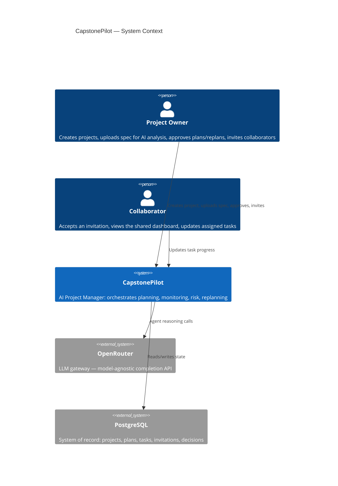
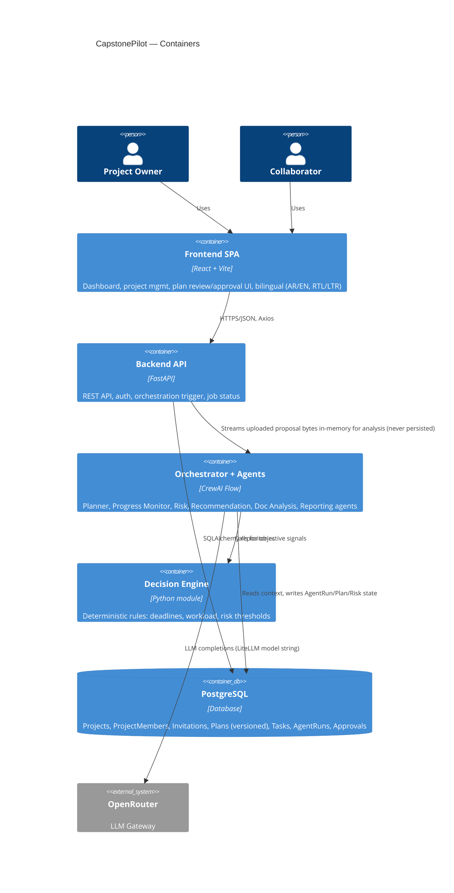

# CapstonePilot — Iteration 1: System Architecture

**Status:** Approved
**Decisions locked in:** Monorepo · LLM via OpenRouter · FastAPI BackgroundTasks + DB polling for async jobs · JWT auth with roles (`project_owner`, `collaborator`)

---

## 1. Why this architecture

CapstonePilot's core claim is that it behaves like a **Living Project Manager**, not a CRUD app with a chatbot bolted on. That claim has three concrete architectural consequences:

1. **The Plan is versioned data, not a UI state.** Every planning/replanning cycle produces a new `Plan` version with a lifecycle (`draft → proposed → approved → superseded`). If the plan were just rows in a `tasks` table with no versioning, "continuously adapts it" and "human-in-the-loop approval" would have nothing to attach to.
2. **Orchestration must be a first-class backend concern, not a prompt.** "One Orchestrator calling specialized agents, combining outputs, requesting approval, executing actions" is a state machine with branching (health-triggered replanning, approval gates). That belongs in code (CrewAI **Flows**), not in a single mega-prompt.
3. **Decisions are hybrid (rules + LLM) by requirement.** So the Decision Engine has to be a real module the Orchestrator calls — not something implicit inside an LLM call.

Everything below exists to serve those three points, kept as simple as it can be while still satisfying them — no Celery, no microservices, no premature multi-tenancy.

---

## 2. System Context



---

## 3. Container View (Monorepo)

```
capstonepilot/
├── frontend/     React + Vite SPA
├── backend/      FastAPI + CrewAI service
└── docs/         Architecture, ADRs
```



**No persistent file storage.** An earlier revision of this architecture included a `Document` entity and a local-disk/object-storage adapter for uploaded project files. That was replaced during frontend-backend wiring: uploaded proposals are analyzed **in memory only** (`ProposalAnalysisService`, text-extracted via PyMuPDF/python-docx) and the file is discarded once the request completes. Only the *results* of analysis — Plans, Milestones, Tasks, RiskReports, Recommendations — are persisted, never the original document. This is deliberate: the system treats an uploaded proposal as a one-time analysis input, not a project asset to archive.

---

## 4. Backend: Clean Architecture layers

```
backend/
├── api/              FastAPI routers + Pydantic request/response schemas.
│                      No business logic. Depends on application/.
├── application/       Use cases / services: ProjectService, PlanningService,
│                      OrchestratorService, DecisionEngine, JobRunner.
│                      Depends only on domain/ (interfaces).
├── domain/            Entities (Project, Plan, Task, Milestone, RiskReport,
│                      Recommendation, AgentRun, ApprovalDecision, User) +
│                      repository interfaces (ports). Zero framework imports.
├── infrastructure/    SQLAlchemy models + repository implementations,
│                      CrewAI agent/crew/flow implementations, OpenRouter
│                      LLM client config, file storage adapter, JWT/security.
└── core/              Config (env), DI wiring, app startup.
```

**Why this shape:** the requirement explicitly asks for SOLID + Clean Architecture + repository pattern. The concrete payoff: `application/` never imports `sqlalchemy` or `crewai` directly — it depends on interfaces defined in `domain/`. That means we can unit-test `PlanningService` with fake repositories, and we can swap CrewAI for something else later without touching API routes.

**Orchestrator placement:** `OrchestratorService` lives in `application/`, but the actual CrewAI `Flow` it drives lives in `infrastructure/agents/`. The service depends on an `OrchestratorPort` interface — so the API layer talks to "the orchestrator," never to CrewAI specifics.

---

## 5. Orchestration Design: CrewAI Flow, not a hand-rolled loop

CrewAI ships a primitive for exactly this shape of problem: **Flows** (`@start`, `@listen`, `@router`, typed state). Rather than reinventing an orchestrator loop, the Orchestrator Agent is implemented as one Flow that:

- Holds **Flow state** = the project's live orchestration context (project id, current plan version, latest health signals).
- Coordinates six **single-purpose Crews**, one per specialized agent: Planner, Progress Monitor, Risk Analysis, Recommendation, Documentation Analysis, Reporting.
- Uses `@router` steps for branching: e.g. after Progress Monitor runs, route to Risk Analysis only if the Decision Engine flags a threshold breach.
- Persists state transitions to the `agent_runs` table so every orchestration cycle is auditable.

```mermaid
flowchart TD
    A[Trigger: new project / task update / schedule tick] --> B[Orchestrator Flow starts]
    B --> C[Documentation Analysis Crew\n(only on new/updated docs)]
    C --> D[Planner Crew\ndrafts Plan v_n]
    D --> E{Project Owner review}
    E -->|Edit/Reject| D
    E -->|Approve| F[Plan v_n: approved\nOrchestrator executes\ntasks/milestones]
    F --> G[Progress Monitoring Crew\n(continuous)]
    G --> H[Decision Engine:\nrule-based health check]
    H -->|Healthy| G
    H -->|Risk threshold breached| I[Risk Analysis Crew]
    I --> J[Recommendation Crew]
    J --> K[Orchestrator assembles\nReplan Proposal = Plan v_n+1 draft]
    K --> L{Project Owner approves replan?}
    L -->|No| G
    L -->|Yes| F
```

**Why Flows over a custom orchestrator class:** we get typed state, conditional routing, and resumability for free, and it keeps the "temporary dynamic agents" future requirement cheap — a new Crew is just a new node the Flow can route to, without changing the Flow's control structure.

**Isolation:** the Flow and its Crews live entirely in `infrastructure/agents/`. `OrchestratorService.run(project_id, trigger)` is the only entry point the rest of the backend calls.

---

## 6. Decision Engine — hybrid rules + LLM

A plain Python module (`application/decision_engine/`), called by the Flow at specific points, not an agent itself:

| Signal | Computed by | Example rule |
|---|---|---|
| Schedule variance | Rule | `(days_elapsed / planned_days) - (tasks_done / tasks_total) > 0.15` → flag |
| Workload imbalance | Rule | stddev of open-task-count across members > threshold |
| Overdue ratio | Rule | `overdue_tasks / total_tasks > 0.2` → flag |
| Interpretation of *why* + proposed fix | LLM (Risk / Recommendation crews) | given the rule-flagged facts + project context, explain risk and propose 2–3 concrete adjustments |

The Flow always computes rule-based facts first and injects them as structured context into the LLM crew's task input — the LLM never has to guess numbers it can be given, and objective thresholds stay deterministic and testable without hitting the LLM at all.

---

## 7. Core Domain Model


`AGENT_RUN` doubles as the **async job record**: every backend-triggered orchestration cycle creates one row, `status` moves `queued → running → succeeded/failed`, and the frontend polls it.

---

## 8. Async Execution (BackgroundTasks + polling)

- `POST /projects/{id}/plan/generate` → creates an `agent_runs` row (`status=queued`) → `BackgroundTasks.add_task(orchestrator_service.run, ...)` → returns `202 { job_id }` immediately.
- Orchestrator Flow updates the same row as it progresses through steps (`running`, then `succeeded`/`failed`, with `output_ref` pointing at the resulting Plan/Report).
- Frontend polls `GET /jobs/{job_id}` every ~2s and renders a "Project Manager is working..." state — this is also the seam for the Iteration-6 dashboard's live activity feed.
- **Explicit trade-off:** single-process concurrency (no distributed workers, no retries-on-crash). Acceptable at capstone scale. The contract (`JobRunnerPort.enqueue(job)`) is the swap point if this ever needs to become Celery/RQ later — nothing above that interface changes.

---

## 9. Auth & RBAC

- FastAPI `OAuth2PasswordBearer` + JWT (access token; refresh token deferred unless requested).
- Passwords hashed with `bcrypt` directly (not via `passlib` — see the frontend-backend-wiring changelog below for why).
- CapstonePilot is built for **student teams only**, not academic supervisors. Two roles, both peers on the team: `project_owner`, `collaborator`. Enforced via a `require_role(...)` FastAPI dependency plus a per-project ownership check (`ProjectService.assert_owner` / `InvitationService._assert_owner`) — a global `project_owner` role lets you create *your own* projects, it does not grant rights over projects you don't own. Displayed in the UI as **"Project Owner"** and **"Collaborator"**.
- **Project Owner:** creates projects, uploads a spec for AI analysis, invites Collaborators (by email or shareable link), manages project settings, approves Plan/Replan proposals, can delete the project.
- **Collaborator:** accepts an invitation, views the shared dashboard, updates assigned tasks. Cannot create projects, cannot upload a project specification, cannot delete a project.
- Every approval (`ApprovalDecision`) is stored, not just applied — this is the audit trail the "human in the loop" requirement implies.

---

## 10. Frontend Architecture (feature-based)

```
frontend/src/
├── app/            Router, layout shell, providers (QueryClient, Auth, i18n)
├── features/
│   ├── auth/
│   ├── projects/
│   ├── documents/
│   ├── planning/       plan review/approval UI, timeline, milestones
│   ├── dashboard/      health, activity feed, charts (Recharts)
│   ├── risks/
│   └── reports/
│   each feature: api/ (axios calls + React Query hooks), components/, pages/
└── shared/
    ├── components/     shadcn/ui-based primitives, no inline styles
    ├── hooks/
    ├── lib/            axios instance, query client
    └── i18n/           en.json, ar.json, language context
```

- **Server state:** React Query (cache, polling for job status, invalidation on mutations) — not hand-rolled `useEffect` fetching.
- **i18n:** `react-i18next` + `i18next-browser-languagedetector`; `<html dir="rtl|ltr">` toggled on language change; preference persisted to `localStorage` and to `User.preferred_language` once authenticated. Tailwind uses logical properties (`ps-`, `pe-` / `rtl:` variants) instead of hardcoded `left`/`right`.
- **Language independence:** UI language (interface) and proposal-document language (content understanding) are independent concerns — `User.preferred_language` drives what language the LLM responds in; the language a submitted proposal happens to be written in only affects extraction/analysis quality in `ProposalAnalysisService`, never UI translation. Since proposals aren't persisted, there is no stored `detected_language` field to carry between requests.

---

## 11. LLM Integration (OpenRouter)

CrewAI's `LLM` class is LiteLLM-backed, so OpenRouter is addressed as a model string, not a separate SDK:

```python
LLM(model="openrouter/anthropic/claude-...", api_key=settings.OPENROUTER_API_KEY)
```

This lets us pick a **different model per agent role** through one config block — e.g. a cheaper/faster model for Documentation Analysis (extraction-heavy) vs a stronger reasoning model for Planner/Risk — all billed through a single OpenRouter key. Model choice becomes a config change, not a code change.

---

## 12. Key Trade-offs (explicit)

| Decision | Upside | Cost | Mitigation |
|---|---|---|---|
| BackgroundTasks over Celery | Zero extra infra to run/deploy | No retries across process crashes, single-node only | `JobRunnerPort` interface isolates the swap |
| CrewAI Flows over custom orchestrator | Built-in state + branching, less code to maintain | Framework coupling | Confined entirely to `infrastructure/agents/` |
| Repository pattern | Testable, DB-agnostic domain/application layers | More files/indirection than direct ORM calls | Required by the stated SOLID/Clean Architecture goal |
| Plan versioning (not in-place edits) | Replanning, audit trail, "living plan" narrative all fall out of this for free | Slightly more complex queries ("get current approved plan") | One repository method: `get_current(project_id)` |

---

## 13. What Iteration 1 explicitly defers

- Exact Postgres schema/migrations → Iteration 9 (Backend APIs) / Alembic setup.
- CrewAI agent prompts/tools in detail → Iteration 10–11.
- Deployment topology (Docker, hosting) → Iteration 15.
- Dynamic/temporary agent creation mechanism → will hang off the same Flow-routing design in §5, detailed once the fixed agents exist.

---

## Iteration 2: Folder Structure — Approved

The monorepo skeleton (empty directories, no dependencies/code yet) was scaffolded per this architecture:

```
capstonepilot/
├── docs/architecture.md
├── backend/
│   ├── app/
│   │   ├── api/{v1/routers, schemas}
│   │   ├── application/{services, decision_engine, ports}
│   │   ├── domain/entities
│   │   ├── infrastructure/{db/{models,repositories,migrations}, agents/{flows,crews,tools}, jobs, storage, security}
│   │   └── core
│   └── tests/{unit, integration}
└── frontend/
    └── src/
        ├── app/{layout, providers}
        ├── features/{auth,projects,documents,planning,dashboard,risks,reports}/{api,components,pages,hooks}
        └── shared/{components/{ui,common}, hooks, lib, i18n/locales}
```

Project tooling (`package.json`, `pyproject.toml`, Vite/Tailwind config, dependency installs) is deferred to **Iteration 3: Project Setup**.

---

## Frontend-Backend Wiring — Approved

Iteration 9 (Backend APIs) shipped the REST layer; this pass replaced the frontend's hardcoded mock data with real calls against it, ahead of CrewAI integration (Iteration 10). Several design decisions came out of doing this for real rather than against a spec:

**Auth is now real.** A `LoginPage` (`POST /auth/login`), an `AuthProvider` context (JWT in `localStorage`, hydrated via `GET /users/me` on load), and a `ProtectedRoute` guard wrap every `AppShell` route. The Topbar shows the actual logged-in user and role, with a working logout (role labels were renamed to "Project Owner"/"Collaborator" in the pass documented further below). This wasn't optional — nearly every endpoint requires a bearer token, so nothing else could be wired without it first.

**`ProjectMember` was added — a real gap in the original domain model.** The ERD only ever modeled `User.owns → Project`, with no concept of team membership. The frontend's "Team Members" UI (chips on Create Project, the Team card on Project Detail) had nothing to bind to. Added as its own table (`project_members`, unique on `project_id` + `user_id`), a repository, a `ProjectMemberService` (add by email / list / remove), and endpoints under `/projects/{id}/members`. Adding a member now requires them to be an already-registered user (looked up by email) — the old free-text "type any name" input couldn't survive contact with a real backend.

**Documents were removed entirely — this was the biggest pivot.** The original architecture had a persisted `Document` entity + local-disk file storage. Wiring the frontend up against it exposed a real product decision: an uploaded project proposal isn't a project asset to archive, it's a one-time input to AI analysis. So:
- The `Document` entity, table, repository, service, schemas, router, and the `FileStorage` port/adapter were all deleted (migration `d1d755ae53e9` drops the `documents` table and adds `project_members` in the same revision).
- Replaced with `POST /projects/{id}/analyze-proposal`: accepts a PDF/DOCX/TXT file, extracts its text **in memory** (PyMuPDF / python-docx), and returns a result. The file is never written to disk or the database — it goes out of scope when the request completes.
- Text extraction is real. Plan/Milestone/Task/RiskReport/Recommendation generation *from* that text is not — that's CrewAI's job (Iteration 10+), and the response is honestly scoped to what actually happens today (extraction), not what will happen once the orchestrator exists.
- Consequence: Create Project became a two-stage flow. `ProjectMember` and the proposal upload both need a real `project_id` to attach to, the same constraint that forced the document-upload timing question in the first place. Stage 1 (name/description/dates) creates the project; stage 2 (team members + optional proposal analysis), shown on the same page once the project exists, was previously going to be document upload alone but generalized to cover both once the members gap surfaced.

**Progress became project-scoped.** `/progress` (global, implicitly showing "the one project") moved to `/projects/{id}/progress`, reached via a "View Plan" action on Project Detail. Milestone completion % and status badges are computed client-side from real per-milestone task lists (`useQueries` fetches every milestone's tasks in parallel; the same query keys are reused inside each `MilestoneAccordion`, so React Query dedupes rather than double-fetching). Clicking a task's status icon cycles `pending → in_progress → done` against `PATCH /tasks/{id}` — the one piece of real interactivity beyond read-only display, matching the "Update Progress" operational action the human-in-the-loop section already allowed for.

**Dashboard, Risks, and Recommendations stay on mock data, visibly.** All three depend on data that doesn't exist yet — `RiskReport`/`Recommendation` have no endpoints until Iterations 12-13, and Dashboard has no "which project" concept to aggregate around even where real data exists (Task/Milestone). Rather than half-wire them into something misleading, each carries a `PreviewDataBanner` stating plainly that it's preview data and when it connects.

---

## Project Owner / Collaborator Simplification — Approved

CapstonePilot is for student capstone teams, not academic supervisors. This pass simplified the role model and the creation flow to match that directly, rather than the more general RBAC shape the earlier iterations had assumed.

**Role rename, all the way through, not just labels.** `member` → `collaborator` (the enum value itself, not just the UI string) across the domain, database, seed data, and tests. `project_owner` keeps its name but is now displayed as **"Project Owner"** (not "Project Lead" — that was the previous pass's guess before this session specified exact terminology). `collaborator` displays as **"Collaborator"**. There is no third role and no supervisor concept anywhere in the system.

**A real authorization gap got fixed while touching this code.** `require_role(PROJECT_OWNER)` only ever checked a caller's *global* role — it never checked whether they owned the *specific* project being mutated. Any project-owner-role user could previously PATCH or DELETE any other owner's project. Since "Collaborator cannot delete the project" only means something if "Project Owner can" is actually scoped to *their* project, this was fixed now: `ProjectService.assert_owner` and `InvitationService._assert_owner` both check `project.owner_id == requesting_user.id`, not just the role claim. Covered by `test_only_the_owning_project_owner_can_update_or_delete`.

**Direct "add member by email" was replaced with real invitations — Collaborators now consent.** The previous pass let a Project Owner add *any* registered user to a project just by typing their email, no acceptance step. That's gone. A new `Invitation` entity (table `invitations`: `project_id`, `email` nullable, unique `token`, `status` pending/accepted/revoked, `invited_by`, `accepted_by`/`accepted_at`) backs two flows:
- **Email invite:** `POST /projects/{id}/invitations` with one or more addresses. Single-use per email — accepting requires the authenticated user's email to match the invitation, and flips it to `accepted`. If the address isn't registered yet, the invitation just sits `pending`; `GET /invitations/mine` (matched by the current user's email) is how it becomes visible once they do register and log in — no email-sending infrastructure exists, so this is the whole delivery mechanism today. The domain layer doesn't assume SMTP either way, so plugging in real delivery later is additive, not a rewrite.
- **Link invite:** `POST /projects/{id}/invitations/link` gets-or-creates one reusable invitation per project (`email = NULL`). Anyone who calls `POST /invitations/{token}/accept` while authenticated joins — multiple people can use the same link, and accepting does *not* flip its status, so it stays valid until the owner explicitly revokes it (`DELETE /invitations/{id}`). No expiry timer, matching "expire only if the owner revokes it."

Both flows funnel into the same `ProjectMemberService.add_member(project_id, user_id)` for the actual membership row — `Invitation` is a consent/pending layer in front of `ProjectMember`, not a replacement for it.

**Create Project is now the literal 4-step flow requested:** Name → Description → Upload Project Specification (optional, PDF/DOCX) → **Generate AI Project Plan**. Creation and proposal analysis happen together behind that one button (create the project, then analyze the file if one was provided) rather than as two separate stages — the previous pass's "create, then optionally upload after" became "fill everything in, then one combined action" once Team Members moved out of this page entirely. Start Date/Deadline stayed as optional fields (kept, not dropped, per this session's direction) but are visually secondary to the 4 numbered steps.

**"Invite Collaborators" now lives in Project Settings, not on the creation page.** A new `/projects/{id}/settings` route (Project Owner-only, both via a frontend check on `project.owner_id` and the backend's real ownership check) holds project name/description editing, the email-invite form, the "copy invite link" action, a list of sent invitations with revoke, and project deletion behind a confirm step. Create Project's post-creation success state links here ("Invite Team Members") instead of duplicating the invite UI on two pages.

**A Register page and public routing exist now, for one reason: the link-invite flow requires it.** "Anyone opening the link should log in if they have an account, otherwise register first, then automatically join" isn't satisfiable without a real registration page, so one was built (`/register`, public, auto-login on success like `/login`). `/invite/:token` sits behind `ProtectedRoute` — an unauthenticated visitor is redirected to `/login` with the invite path preserved as the post-auth destination, exactly like any other protected route; the accept call fires once auth resolves.

Verified: 24 backend tests (up from 20 — added ownership-boundary, email-invite-pending, duplicate-member, wrong-email-acceptance, revoked-invitation, and link-reusability cases; removed the direct-add-member tests since that capability no longer exists), ruff clean, frontend build and oxlint clean. Same limitation as every prior pass: no browser tool here, so the actual in-browser flows (register → auto-join via link, email invite → accept from the pending-invitations view, settings-page delete confirmation) have not been visually verified.

---

## Figma-Style Sharing, Notifications, and Data-Integrity Fixes — Approved

This pass replaced the Settings-page invite panel with a real Share dialog (Figma/Canva-style), added the pieces that panel implied but didn't have yet (email delivery, expiry, resend), and fixed two correctness gaps in existing code that surfaced while making project deletion actually safe. Two requests in this pass directly reversed constraints from the previous one; both are called out explicitly below rather than silently overridden.

**Two prior constraints were deliberately reversed, on this session's explicit instruction:**
- *"Do not implement email delivery now"* → reversed. An `EmailService` port now exists (`send_invitation_email`), with an `SmtpEmailService` (stdlib `smtplib`, configured via `SMTP_HOST`/`PORT`/`USERNAME`/`PASSWORD`/`FROM_EMAIL` in `.env`) and a `ConsoleEmailService` fallback used automatically whenever `SMTP_HOST` is unset. No real SMTP credentials exist in this environment, so today every invite prints the email to the backend console (`[email:console] ...`) rather than actually delivering — the moment real credentials are added to `.env`, delivery starts working with no code change, which was the point of designing it as a port in the first place.
- *"The invitation should expire only if the owner revokes it"* → reversed for **email invitations only** (7-day expiry, `Invitation.expires_at`, enforced in `accept_invitation` as `InvitationExpiredError` → `410 Gone`, same status code as revocation). **Link invitations keep the original behavior** — `expires_at` stays `NULL` for them, so a shareable link still only stops working when the owner explicitly revokes it. This split reflects that the two invitation types are semantically different (a link is reusable and open-ended by design; an email invite is a single targeted offer with a shelf life), and was the most direct way to satisfy both instructions rather than picking one to ignore.

**The Share dialog replaces the old page.** `ProjectDetailPage` gained a `Share` button (top-right) opening `ShareModal`: an invite-by-email form + shareable-link card (owner-only), a unified "People with access" list (the owner, synthesized from the project's now-included `owner_name`/`owner_email` fields, plus accepted collaborators, plus pending email invitees shown inline with a Pending badge), and a separate "Pending Invitations" section with per-invitation **Resend**, **Copy Link**, and **Cancel** actions. `ProjectSettingsPage` no longer duplicates any of this — it's back to just project details + delete. The old `TeamMembersSection`/`TeamMemberChip`/`PendingInvitationsList` components were deleted outright rather than left unused.

**Resend is a new capability, not just a UI label.** `POST /invitations/{id}/resend` (owner-only, email invitations only, must still be pending) refreshes `expires_at` by another 7 days, keeps the same token so any copy of the old link still works, and re-sends through `EmailService`.

**A public, unauthenticated preview endpoint now exists so the invite-accept flow doesn't have to guess.** `GET /invitations/{token}/preview` returns the project name, the invitation's email (if any), and whether that email already has an account — enough for `InviteAcceptPage` to route a signed-out visitor straight to `/register` (prefilled, email locked) when they're clearly new, or to `/login` otherwise, instead of always bouncing through Login first. `/invite/:token` moved out of `ProtectedRoute` to a public top-level route to make this possible — an authenticated visitor still goes straight through the accept flow exactly as before.

**Two correctness gaps got fixed, surfaced by making project deletion and member removal actually safe:**
- `ProjectMemberService.remove_member` never checked that the caller owned *that* project — same class of bug fixed for `ProjectService`/`InvitationService` in the previous pass, missed here. Now takes `requesting_user_id`, asserts ownership, and also rejects removing the owner themselves (`CannotRemoveOwnerError`) — the UI never renders a remove option on the owner's own row, but the backend enforces it independently since transferring ownership isn't built yet.
- `ProjectService.delete_project` only ever deleted the `projects` row itself. SQLite's foreign keys aren't enforced in this app (`PRAGMA foreign_keys` is off), so this silently left orphaned `project_members`, `invitations`, `plans`, `milestones`, and `tasks` rows behind rather than erroring. Rather than turning on FK enforcement and cascading at the schema level (a riskier, batch-mode migration touching most of the tables), the cascade is now explicit in the service: tasks → milestones → plans → members → invitations → project, in that order, using each repository's existing `list_by_*`/`delete` methods plus two new bulk `delete_by_project` methods. `agent_runs`/`risk_reports`/`recommendations`/`approval_decisions` are intentionally not part of this cascade — nothing in the app writes to those tables yet (they're CrewAI-era stubs), so there's nothing to orphan until those features exist, at which point their cascade needs adding too.

**A toast notification system exists for the first time.** `sonner` (a small, dependency-free toast library — chosen over hand-rolling one, since this is exactly the kind of small, well-solved UI problem not worth re-deriving) is mounted once in `App.jsx`. Every mutation hook that previously invalidated a query cache silently now also toasts success/failure: project create/update/delete, invite sent/resent/cancelled, collaborator removed. Toasting "collaborator joined" from the *inviting owner's* perspective was scoped out — there's no push channel (websockets) to tell an owner's open tab that someone else just accepted elsewhere; the collaborator list still updates without a refresh because it shares a query key with the modal that shows it, but that's cache-driven consistency, not a live notification.

**Project cards got their own three-dot menu** (Open / Edit / Delete, owner-only), reusing the new shared `DropdownMenu`, `Modal`, and `ConfirmDialog` primitives (`shared/components/ui/`) that the Share dialog and Project Detail's own new Actions menu (Edit / Archive-placeholder / Delete) also build on — one confirm-dialog implementation now backs every delete flow in the app instead of each page hand-rolling its own. `ProjectDetailPage` also gained the breadcrumb (`Projects / {name}`) and `← Back to Projects` link it never had.

Verified: 31 backend tests (up from 24 — added owner-info-on-read, resend (happy path, link-invitation rejection, ownership), preview (known/unknown email, 404), expiry-enforced-on-accept, owner-removal-blocked, non-owner-removal-forbidden, and cascade-delete-leaves-no-orphans cases), ruff clean, and a full manual `curl` walkthrough against a locally running `uvicorn` covering invite → preview → resend → accept → owner-removal-rejected → delete-cascade end to end (including confirming the console-fallback email actually prints). Frontend: `npm run build` and `oxlint` both clean.

**Addendum — real browser verification, not just code review.** The "no browser tool" limitation noted above (and in every prior pass) was closed out in the same session: `@playwright/test` was added (`frontend/tests/e2e/app.spec.js`, `npm run test:e2e`), and a 14-case suite was run against the actual `vite`+`uvicorn` dev servers in Chromium — register → create project → breadcrumb/back nav → Share dialog email invite → copy shareable link (real clipboard read) → resend → a second browser context accepting the link (register → auto-join) → owner sees the collaborator as Accepted → re-inviting that now-existing member surfaces the real error toast → cancel a pending invite → remove a collaborator → Archive placeholder toast → delete from the detail page's Actions menu (redirect + toast) → delete from a card's menu in the list. All 14 pass, twice in a row with fresh data each run. Two real bugs surfaced and were fixed by this process, not hypothesized in review: `Modal` had no `role="dialog"`/accessible name, making its content unaddressable by assistive tech and by tests alike (now fixed, which is an accessibility fix as much as a testability one); and the two `hasText` row-scoping locators in the first draft of the test were fragile DOM-traversal guesses that resolved to the wrong element - fixed by adding `data-testid="access-row"`/`data-testid="pending-invitation-row"` to `ShareModal`'s row containers rather than continuing to guess ancestor depth.

---

## Share Dialog Polish, Link Lifecycle, and a Real StrictMode/React-Query Bug — Approved

A follow-up pass on the Share dialog, matching a more literal Figma/Canva/Notion reference layout, plus one debugging session that turned up a genuine, non-obvious production bug worth documenting in full since it wasn't hypothetical - it was caught, reproduced, and fixed via the Playwright suite added in the previous pass.

**Share dialog reordered to lead with the link, not the email form.** The shareable link is now the first thing in the dialog (with "Anyone with this link can join this project." framing text), followed by an explicitly labeled "Optional — Invite by Email" section with copy clarifying the link is the primary sharing method. A visible **Close** button was added at the bottom of the dialog (in addition to the existing header `×` / backdrop-click / Escape) since the reference layout calls it out as part of the structure, not just an implicit affordance.

**Link lifecycle is now fully manageable, not just copyable.** `InviteLinkCard` was rebuilt to derive its state from the project's real invitation list (via a new `linkEverExisted` flag - has a link invitation ever existed for this project, active or revoked) instead of only reacting to its own mutation's result, and gained two new actions:
- **Regenerate Link** - `POST /projects/{id}/invitations/link/regenerate` (new endpoint, `InvitationService.regenerate_link_invitation`) atomically revokes whatever link is currently active and mints a fresh token, so old copies of the link stop working immediately. Implemented server-side rather than as two separate frontend calls specifically to avoid a window where neither link is valid or both are.
- **Disable Link** - reuses the existing revoke endpoint (a link invitation is revoked exactly like an email one) but is exposed as its own hook (`useDisableLinkInvitation`) purely so the toast reads "Invite link disabled" instead of "Invitation cancelled." Once disabled, the card shows "Link sharing is currently disabled for this project." and a **Create New Link** button rather than silently regenerating one - silently recreating it would defeat the point of the owner explicitly turning it off.

**"Transfer ownership before leaving" is now a real (if honest) UI affordance.** The owner's own row in "People with access" gained a three-dot menu - previously the owner had no menu at all, since they can't remove themselves. Its one item shows a toast explaining that ownership transfer isn't built yet, following the same honest-placeholder pattern as "Archive Project" from the previous pass, rather than a dead-looking disabled control.

**A production correctness gap: three GET endpoints didn't support request cancellation.** `getProjects`, `getProjectById`, `getProjectMembers`, and `getProjectInvitations` didn't accept or forward React Query's `AbortSignal` to axios. Confirmed via Playwright + direct DB inspection that this let an earlier, slower in-flight refetch resolve *after* a later one and silently overwrite the query cache with stale data - reproducible by regenerating and then immediately disabling the invite link, two rapid-fire actions that each invalidate the same query. All four now thread `signal` through (`apiClient.get(url, { signal })`), letting React Query actually cancel superseded requests instead of racing them.

**A second, deeper bug in the same investigation: mutations fired from a mount effect can get stuck.** The dialog auto-creates a shareable link the moment it opens rather than waiting for a first click. That auto-create was originally a `useMutation().mutate()` call inside a `useEffect`. Under React 19 StrictMode's dev-mode double-invocation of effects, this left `mutation.isPending` (and even a per-call `onSettled` callback passed directly to `.mutate()`) stuck reporting "still pending" *forever* - even though the underlying HTTP request had already succeeded and the query cache had the correct data. The UI would get permanently stuck showing "Preparing your invite link..." with all actions disabled, but only in scenarios where the link section re-entered its empty state later (e.g., right after Disable) - masked the rest of the time because `linkInvitation` being truthy short-circuited the check. This was tracked down empirically, not by inspection: instrumented with targeted console logging correlated against real network request/response timestamps via Playwright's `page.on('request'/'response')`, across roughly a dozen full-suite reruns, before the actual mechanism (StrictMode detaching the mutation's observer between the phantom unmount and remount) was confirmed. The fix: the auto-create path no longer goes through `useMutation` at all - it calls the plain API function directly inside the effect, manages its own `useState` "preparing" flag via a plain `.finally()`, and calls `queryClient.invalidateQueries` itself on success. A plain promise has no observer to detach, so it can't get stuck. The user-triggered "Create New Link" button still uses the mutation hook normally, since a click handler doesn't have this mount-timing problem.

Verified: 32 backend tests (added `test_regenerate_link_invitation_revokes_old_token_and_requires_ownership`), ruff clean, `npm run build` and `oxlint` clean, and the full 17-case Playwright suite (3 new cases: regenerate, disable-then-recreate, transfer-ownership placeholder) passing 6 consecutive full runs with zero flakes after the StrictMode fix - it had failed on 1 of every ~4 runs before it, which is exactly the kind of intermittent failure that's easy to dismiss as "flaky test" rather than a real bug; it wasn't.
