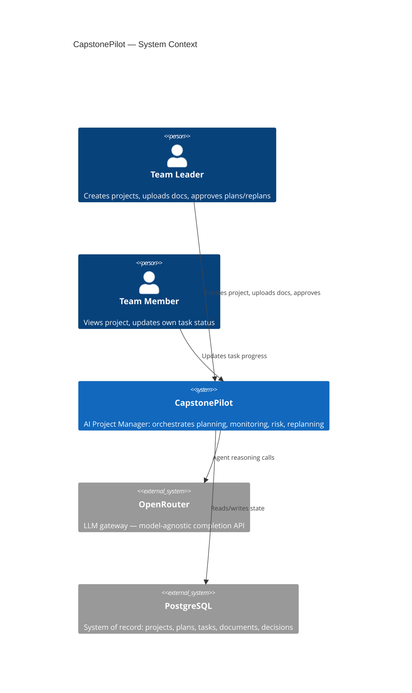
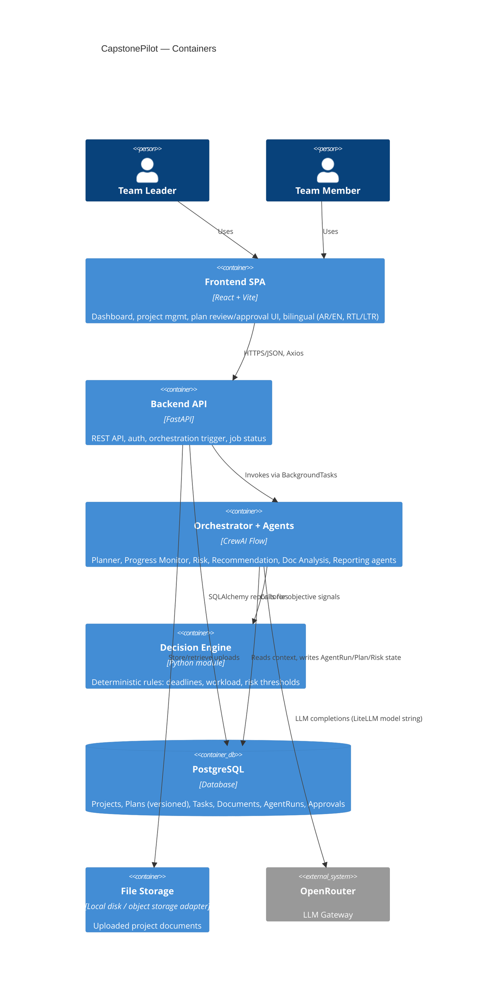
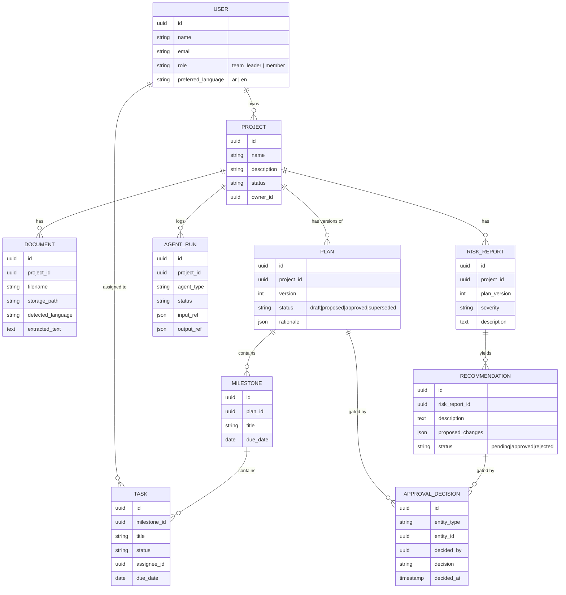

# CapstonePilot — Iteration 1: System Architecture

**Status:** Approved
**Decisions locked in:** Monorepo · LLM via OpenRouter · FastAPI BackgroundTasks + DB polling for async jobs · JWT auth with roles (`team_leader`, `member`)

---

## 1. Why this architecture

CapstonePilot's core claim is that it behaves like a **Living Project Manager**, not a CRUD app with a chatbot bolted on. That claim has three concrete architectural consequences:

1. **The Plan is versioned data, not a UI state.** Every planning/replanning cycle produces a new `Plan` version with a lifecycle (`draft → proposed → approved → superseded`). If the plan were just rows in a `tasks` table with no versioning, "continuously adapts it" and "human-in-the-loop approval" would have nothing to attach to.
2. **Orchestration must be a first-class backend concern, not a prompt.** "One Orchestrator calling specialized agents, combining outputs, requesting approval, executing actions" is a state machine with branching (health-triggered replanning, approval gates). That belongs in code (CrewAI **Flows**), not in a single mega-prompt.
3. **Decisions are hybrid (rules + LLM) by requirement.** So the Decision Engine has to be a real module the Orchestrator calls — not something implicit inside an LLM call.

Everything below exists to serve those three points, kept as simple as it can be while still satisfying them — no Celery, no microservices, no premature multi-tenancy.

---

## 2. System Context



---

## 3. Container View (Monorepo)

```
capstonepilot/
├── frontend/     React + Vite SPA
├── backend/      FastAPI + CrewAI service
└── docs/         Architecture, ADRs
```



---

## 4. Backend: Clean Architecture layers

```
backend/
├── api/              FastAPI routers + Pydantic request/response schemas.
│                      No business logic. Depends on application/.
├── application/       Use cases / services: ProjectService, PlanningService,
│                      OrchestratorService, DecisionEngine, JobRunner.
│                      Depends only on domain/ (interfaces).
├── domain/            Entities (Project, Plan, Task, Milestone, RiskReport,
│                      Recommendation, AgentRun, ApprovalDecision, User) +
│                      repository interfaces (ports). Zero framework imports.
├── infrastructure/    SQLAlchemy models + repository implementations,
│                      CrewAI agent/crew/flow implementations, OpenRouter
│                      LLM client config, file storage adapter, JWT/security.
└── core/              Config (env), DI wiring, app startup.
```

**Why this shape:** the requirement explicitly asks for SOLID + Clean Architecture + repository pattern. The concrete payoff: `application/` never imports `sqlalchemy` or `crewai` directly — it depends on interfaces defined in `domain/`. That means we can unit-test `PlanningService` with fake repositories, and we can swap CrewAI for something else later without touching API routes.

**Orchestrator placement:** `OrchestratorService` lives in `application/`, but the actual CrewAI `Flow` it drives lives in `infrastructure/agents/`. The service depends on an `OrchestratorPort` interface — so the API layer talks to "the orchestrator," never to CrewAI specifics.

---

## 5. Orchestration Design: CrewAI Flow, not a hand-rolled loop

CrewAI ships a primitive for exactly this shape of problem: **Flows** (`@start`, `@listen`, `@router`, typed state). Rather than reinventing an orchestrator loop, the Orchestrator Agent is implemented as one Flow that:

- Holds **Flow state** = the project's live orchestration context (project id, current plan version, latest health signals).
- Coordinates six **single-purpose Crews**, one per specialized agent: Planner, Progress Monitor, Risk Analysis, Recommendation, Documentation Analysis, Reporting.
- Uses `@router` steps for branching: e.g. after Progress Monitor runs, route to Risk Analysis only if the Decision Engine flags a threshold breach.
- Persists state transitions to the `agent_runs` table so every orchestration cycle is auditable.

```mermaid
flowchart TD
    A[Trigger: new project / task update / schedule tick] --> B[Orchestrator Flow starts]
    B --> C[Documentation Analysis Crew\n(only on new/updated docs)]
    C --> D[Planner Crew\ndrafts Plan v_n]
    D --> E{Team Leader review}
    E -->|Edit/Reject| D
    E -->|Approve| F[Plan v_n: approved\nOrchestrator executes\ntasks/milestones]
    F --> G[Progress Monitoring Crew\n(continuous)]
    G --> H[Decision Engine:\nrule-based health check]
    H -->|Healthy| G
    H -->|Risk threshold breached| I[Risk Analysis Crew]
    I --> J[Recommendation Crew]
    J --> K[Orchestrator assembles\nReplan Proposal = Plan v_n+1 draft]
    K --> L{Team Leader approves replan?}
    L -->|No| G
    L -->|Yes| F
```

**Why Flows over a custom orchestrator class:** we get typed state, conditional routing, and resumability for free, and it keeps the "temporary dynamic agents" future requirement cheap — a new Crew is just a new node the Flow can route to, without changing the Flow's control structure.

**Isolation:** the Flow and its Crews live entirely in `infrastructure/agents/`. `OrchestratorService.run(project_id, trigger)` is the only entry point the rest of the backend calls.

---

## 6. Decision Engine — hybrid rules + LLM

A plain Python module (`application/decision_engine/`), called by the Flow at specific points, not an agent itself:

| Signal | Computed by | Example rule |
|---|---|---|
| Schedule variance | Rule | `(days_elapsed / planned_days) - (tasks_done / tasks_total) > 0.15` → flag |
| Workload imbalance | Rule | stddev of open-task-count across members > threshold |
| Overdue ratio | Rule | `overdue_tasks / total_tasks > 0.2` → flag |
| Interpretation of *why* + proposed fix | LLM (Risk / Recommendation crews) | given the rule-flagged facts + project context, explain risk and propose 2–3 concrete adjustments |

The Flow always computes rule-based facts first and injects them as structured context into the LLM crew's task input — the LLM never has to guess numbers it can be given, and objective thresholds stay deterministic and testable without hitting the LLM at all.

---

## 7. Core Domain Model



`AGENT_RUN` doubles as the **async job record**: every backend-triggered orchestration cycle creates one row, `status` moves `queued → running → succeeded/failed`, and the frontend polls it.

---

## 8. Async Execution (BackgroundTasks + polling)

- `POST /projects/{id}/plan/generate` → creates an `agent_runs` row (`status=queued`) → `BackgroundTasks.add_task(orchestrator_service.run, ...)` → returns `202 { job_id }` immediately.
- Orchestrator Flow updates the same row as it progresses through steps (`running`, then `succeeded`/`failed`, with `output_ref` pointing at the resulting Plan/Report).
- Frontend polls `GET /jobs/{job_id}` every ~2s and renders a "Project Manager is working..." state — this is also the seam for the Iteration-6 dashboard's live activity feed.
- **Explicit trade-off:** single-process concurrency (no distributed workers, no retries-on-crash). Acceptable at capstone scale. The contract (`JobRunnerPort.enqueue(job)`) is the swap point if this ever needs to become Celery/RQ later — nothing above that interface changes.

---

## 9. Auth & RBAC

- FastAPI `OAuth2PasswordBearer` + JWT (access token; refresh token deferred unless requested).
- Passwords hashed with bcrypt (`passlib`).
- Two roles: `team_leader`, `member`. Enforced via a `require_role(...)` FastAPI dependency, not scattered `if` checks in handlers.
- **Team Leader–only:** approve/reject Plan versions and Replan proposals, upload strategic documents, invite members, edit approved plan structure.
- **Member:** view project/plan/tasks, update status of tasks assigned to them.
- Every approval (`ApprovalDecision`) is stored, not just applied — this is the audit trail the "human in the loop" requirement implies.

---

## 10. Frontend Architecture (feature-based)

```
frontend/src/
├── app/            Router, layout shell, providers (QueryClient, Auth, i18n)
├── features/
│   ├── auth/
│   ├── projects/
│   ├── documents/
│   ├── planning/       plan review/approval UI, timeline, milestones
│   ├── dashboard/      health, activity feed, charts (Recharts)
│   ├── risks/
│   └── reports/
│   each feature: api/ (axios calls + React Query hooks), components/, pages/
└── shared/
    ├── components/     shadcn/ui-based primitives, no inline styles
    ├── hooks/
    ├── lib/            axios instance, query client
    └── i18n/           en.json, ar.json, language context
```

- **Server state:** React Query (cache, polling for job status, invalidation on mutations) — not hand-rolled `useEffect` fetching.
- **i18n:** `react-i18next` + `i18next-browser-languagedetector`; `<html dir="rtl|ltr">` toggled on language change; preference persisted to `localStorage` and to `User.preferred_language` once authenticated. Tailwind uses logical properties (`ps-`, `pe-` / `rtl:` variants) instead of hardcoded `left`/`right`.
- **Language independence:** UI language (interface) and document language (content understanding) are separate fields — `User.preferred_language` drives what language the LLM responds in; `Document.detected_language` is independent metadata used only for extraction/analysis quality, never for translation of the UI.

---

## 11. LLM Integration (OpenRouter)

CrewAI's `LLM` class is LiteLLM-backed, so OpenRouter is addressed as a model string, not a separate SDK:

```python
LLM(model="openrouter/anthropic/claude-...", api_key=settings.OPENROUTER_API_KEY)
```

This lets us pick a **different model per agent role** through one config block — e.g. a cheaper/faster model for Documentation Analysis (extraction-heavy) vs a stronger reasoning model for Planner/Risk — all billed through a single OpenRouter key. Model choice becomes a config change, not a code change.

---

## 12. Key Trade-offs (explicit)

| Decision | Upside | Cost | Mitigation |
|---|---|---|---|
| BackgroundTasks over Celery | Zero extra infra to run/deploy | No retries across process crashes, single-node only | `JobRunnerPort` interface isolates the swap |
| CrewAI Flows over custom orchestrator | Built-in state + branching, less code to maintain | Framework coupling | Confined entirely to `infrastructure/agents/` |
| Repository pattern | Testable, DB-agnostic domain/application layers | More files/indirection than direct ORM calls | Required by the stated SOLID/Clean Architecture goal |
| Plan versioning (not in-place edits) | Replanning, audit trail, "living plan" narrative all fall out of this for free | Slightly more complex queries ("get current approved plan") | One repository method: `get_current(project_id)` |

---

## 13. What Iteration 1 explicitly defers

- Exact Postgres schema/migrations → Iteration 9 (Backend APIs) / Alembic setup.
- CrewAI agent prompts/tools in detail → Iteration 10–11.
- Deployment topology (Docker, hosting) → Iteration 15.
- Dynamic/temporary agent creation mechanism → will hang off the same Flow-routing design in §5, detailed once the fixed agents exist.

---

## Iteration 2: Folder Structure — Approved

The monorepo skeleton (empty directories, no dependencies/code yet) was scaffolded per this architecture:

```
capstonepilot/
├── docs/architecture.md
├── backend/
│   ├── app/
│   │   ├── api/{v1/routers, schemas}
│   │   ├── application/{services, decision_engine, ports}
│   │   ├── domain/entities
│   │   ├── infrastructure/{db/{models,repositories,migrations}, agents/{flows,crews,tools}, jobs, storage, security}
│   │   └── core
│   └── tests/{unit, integration}
└── frontend/
    └── src/
        ├── app/{layout, providers}
        ├── features/{auth,projects,documents,planning,dashboard,risks,reports}/{api,components,pages,hooks}
        └── shared/{components/{ui,common}, hooks, lib, i18n/locales}
```

Project tooling (`package.json`, `pyproject.toml`, Vite/Tailwind config, dependency installs) is deferred to **Iteration 3: Project Setup**.
